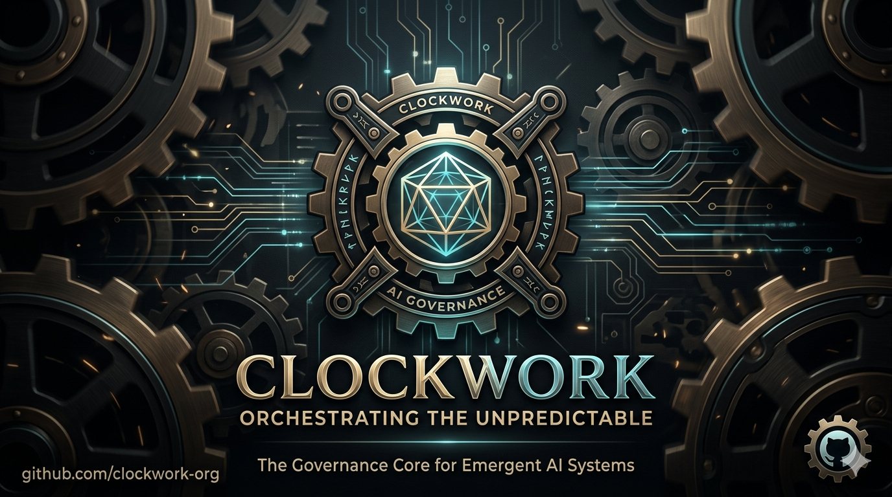

# Clockwork (机关术)

> **The Governance Layer for AI Agents.**
> **为 AI Agent 打造的治理层。**

Inspired by the precision of ancient mechanical arts, **Clockwork** brings order to the chaos of LLM outputs. It transforms unpredictable AI behaviors into a synchronized, high-quality production line.

受古代精密机关术的启发，**Clockwork** 旨在为混乱的 LLM 输出注入秩序。它将不可预测的 AI 行为转变为同步、高效且高质量的生产流水线。

---

## 核心特性

| 特性 | 说明 |
|------|------|
| **Logic Gears** | 严格的工作流阶段定义，不可跳过，不可越权 |
| **Quality Governors** | S1+S2+S3 三层质量校验，确保产物符合黄金标准 |
| **Persistent Pulse** | manifest.yaml 持久化状态，支持断点续做 |
| **并行支持** | 支持阶段并行执行（如测试与实现并行） |
| **CLI 工具** | 命令行工具自动化管理需求和校验 |

---

## 快速开始

### 环境要求

- [Cursor IDE](https://cursor.com) — 本框架专为 Cursor 设计
- Python 3.8+ — 用于 CLI 工具

### 1. 克隆仓库

```bash
git clone <your-clockwork-repo-url> my-project
cd my-project
```

### 2. 安装 CLI（可选）

```bash
pip install pyyaml
chmod +x cli/clockwork.py
```

### 3. 初始化工作空间

```bash
python cli/clockwork.py init
```

### 4. 用 Cursor 打开

```bash
cursor .
```

Cursor 会自动加载 `.cursor/rules/clockwork.mdc` 中的治理规则。

### 5. 告诉 Agent 你的角色

> "我是产品经理，需要定义一个新需求。"
> "我是开发者，要做技术设计。"
> "我是测试工程师，要写测试计划。"

Agent 会自动读取对应的角色定义，并在职责范围内工作。

---

## CLI 命令

```bash
# 创建新需求
clockwork create "Backlog 删除功能" --repo agilehub

# 推进阶段
clockwork advance FEAT-001 tech_design

# 校验产物质量
clockwork validate FEAT-001

# 查看状态
clockwork status FEAT-001

# 列出所有需求
clockwork list

# 解析上下文路径
clockwork context FEAT-001
```

---

## 目录结构

```
clockwork/
├── agents/              # 角色 Agent 定义
│   ├── analyst/         # 项目分析师
│   ├── pm/              # 产品经理
│   ├── developer/       # 开发者
│   ├── tester/          # 测试工程师
│   └── reviewer/        # 代码评审
├── skills/              # 可复用技能
│   ├── create-prd/      # PRD 创建
│   ├── create-tech-design/
│   ├── create-test-plan/
│   ├── analyze-project/ # 项目分析
│   └── validate-artifact/ # 质量校验（S1+S2+S3）
├── workflow/            # 工作流定义与需求产物
│   ├── _definitions/    # 工作流 YAML 定义
│   ├── _templates/      # 产物模板
│   ├── _schemas/        # Schema 约束
│   └── features/        # 需求实例
├── cli/                 # Clockwork CLI 工具
├── docs/                # 项目文档
│   ├── guides/          # 使用指南
│   └── projects/        # 项目简介
├── repos/               # 代码仓库（git submodule）
├── AGENTS.md            # 全局 Agent 治理规则
└── README.md
```

---

## 工作流类型

### feature-development

标准功能开发流程：

```
需求定义 → 技术设计 → 代码实现 → 测试计划 → 代码评审
    PM          Dev          Dev          Tester       Reviewer
```

### feature-development-parallel

支持并行的工作流：

```
需求定义 ──→ 技术设计
    │                    │
    │         ┌───────────┴───────────┐
    │         ↓                       ↓
    └──────→ 代码实现 ←──────────→ 测试计划
                                   (并行)
                              ┌──────────┐
                              ↓ 代码评审 │ (需双方通过)
                              └──────────┘
```

### bugfix

缺陷修复流程：

```
缺陷分析 → 修复实现 → 修复验证 → 修复评审
   Dev        Dev        Tester      Reviewer
```

---

## 质量校验（三层闸门）

| 层级 | 校验内容 | 说明 |
|------|----------|------|
| **S1** | 结构校验 | 必需章节是否完整 |
| **S2** | 内容校验 | 章节内容是否有实质意义，非空占位符 |
| **S3** | 引用校验 | 上游产物引用是否准确存在 |

---

## 详细文档

- [架构说明](docs/architecture.md)
- [快速上手指南](docs/guides/quick-start.md)
- [工作流 Schema 定义](workflow/_schemas/workflow.schema.yaml)

---

## License

[MIT](LICENSE) © 2026 forthends
