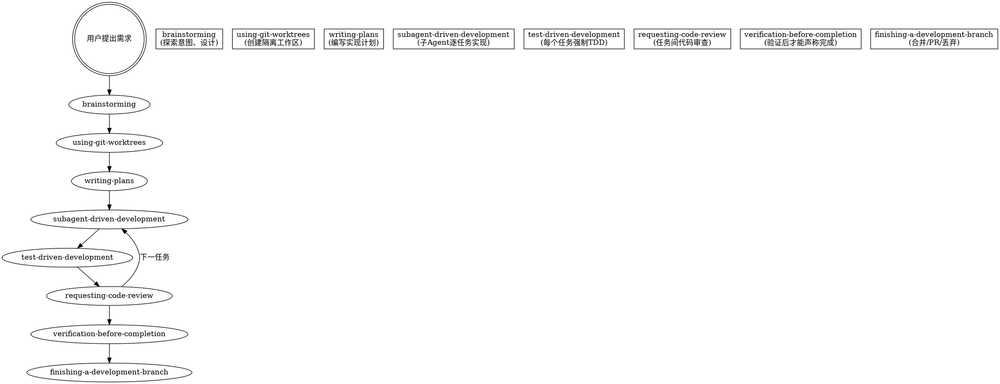

# Superpowers 深度洞察报告

## 一、项目概览

Superpowers（v5.1.0）是一套完整的、构建在 Agent Skills 开放标准之上的**软件开发方法论**，由 Jesse Vincent（Prime Radiant）创建。它通过一组可组合的技能（skills）和会话启动注入机制，从根本上改变了 AI 编程 Agent 的行为模式——从"收到指令就写代码"转变为"先澄清意图、设计、规划、以 TDD 方式实现、审查、验证、收尾"的结构化工程流程。

**核心理念声明：**

> "It starts from the moment you fire up your coding agent. As soon as it sees that you're building something, it _doesn't_ just jump into trying to write code."

---

## 二、架构洞察

### 2.1 引导注入机制（The Bootstrap）

Superpowers 最关键的架构决策是**会话启动时强制注入 `using-superpowers` 技能的内容**。

```
用户启动 Agent → 触发 SessionStart hook
  → hooks/session-start 读取 skills/using-superpowers/SKILL.md
  → 将内容作为 additionalContext 注入系统提示
  → Agent 获得"你必须先检查技能再行动"的元指令
  → 遇到任何任务，先扫描可用技能，找到匹配的则调用 Skill 工具加载
```

这个引导机制通过 `hooks/session-start`（一个 bash 脚本）实现，针对不同平台输出不同的 JSON 格式：

| 平台               | 检测方式                                | 输出格式                               |
| ------------------ | --------------------------------------- | -------------------------------------- |
| Cursor             | `CURSOR_PLUGIN_ROOT` 环境变量           | `additional_context`                   |
| Claude Code        | `CLAUDE_PLUGIN_ROOT` 且无 `COPILOT_CLI` | `hookSpecificOutput.additionalContext` |
| Copilot CLI 及其他 | `COPILOT_CLI=1` 或无上述变量            | `additionalContext`（SDK 标准格式）    |

**关键设计意义：** 这确保 Agent 在任何平台启动时都先获得同样的元认知框架。不同平台的平台适配表（`references/copilot-tools.md`、`references/codex-tools.md`、`references/gemini-tools.md`）将技能中引用的 Claude Code 工具名映射到各平台等效工具。

### 2.2 指令优先级模型

```
1. 用户显式指令（CLAUDE.md, GEMINI.md, AGENTS.md, 直接请求） ← 最高优先级
2. Superpowers 技能                                            ← 覆盖默认系统行为
3. 默认系统提示                                                 ← 最低优先级
```

这是一个精妙的设计：技能是"强制默认"，但用户始终可以覆盖。如果 CLAUDE.md 说"不要用 TDD"而技能说"必须用 TDD"，以用户指令为准。这解决了自动化方法论与用户自主权之间的核心张力。

### 2.3 技能类型分类

Superpowers 将技能分为两大类：

- **刚性（Rigid）**：TDD、systematic-debugging、verification-before-completion。必须精确遵循，不可适配绕过。
- **柔性（Flexible）**：模式类技能。根据上下文适配原则。

技能本身会声明自己的类型，Agent 根据声明决定执行强度。

---

## 三、核心工作流：从想法到合并的完整链路

### 3.1 工作流总览



### 3.2 各阶段详解

#### 阶段 1：brainstorming（头脑风暴）

**触发条件：** 任何创造性工作之前——创建功能、构建组件、添加功能、修改行为。

**硬性门禁：** 在展示设计并获得用户批准之前，**不得调用任何实现技能、编写任何代码、搭建任何项目**。

9 步检查清单：

1. 探索项目上下文（文件、文档、近期提交）
2. 提供可视化伴侣（如涉及视觉问题）
3. 逐个提问澄清意图（一次一个问题，选择题优先）
4. 提出 2-3 种方案及权衡
5. 分节展示设计，逐节获取用户批准
6. 将设计文档保存到 `docs/superpowers/specs/YYYY-MM-DD-<topic>-design.md` 并提交
7. 设计文档自审（占位符扫描、内部一致性、范围检查、歧义检查）
8. 用户审查书面设计文档
9. 过渡到 `writing-plans`

**关键设计原则：**

- 反模式防御："This is too simple to need a design"。每个项目都走这个流程，简单项目可以简短但必须展示和批准。
- 对于多子系统项目，先分解为独立子项目，每个子项目走独立的 spec → plan → implementation 循环。
- 如果用户说"构建一个包含聊天、文件存储、计费和分析的平台"，先标记这个范围问题，帮助分解。

#### 阶段 2：using-git-worktrees（隔离工作区）

**核心原则：** 检测现有隔离 → 优先原生工具 → fallback 到 git worktree。

三个关键步骤：

1. **Step 0: 检测现有隔离** — 通过 `GIT_DIR != GIT_COMMON` 判断是否已在 worktree 中（含子模块守卫检测）
2. **Step 1a: 原生工具优先** — 如果平台提供 `EnterWorktree` 等原生工具，优先使用
3. **Step 1b: Git Worktree Fallback** — 仅在无原生工具时手动创建

目录优先级：已有 `.worktrees/` > 已有 `worktrees/` > 全局路径 `~/.config/superpowers/worktrees/` > 默认 `.worktrees/`

**安全意识：** 项目本地 worktree 目录必须被 `.gitignore` 忽略（用 `git check-ignore` 验证）。

#### 阶段 3：writing-plans（编写实现计划）

**核心理念：** "假设工程师对我们的代码库零上下文，品味存疑。记录他们需要知道的一切。"

**任务粒度：每个步骤 2-5 分钟：**

- "编写失败测试" — 一步
- "运行测试确认失败" — 一步
- "实现最小代码使测试通过" — 一步
- "运行测试确认通过" — 一步
- "提交" — 一步

**计划文档必须包含：**

- 每个任务的确切文件路径
- 完整代码（不是描述，是实际代码）
- 确切的运行命令和期望输出
- 禁止占位符：`TBD`、`TODO`、"添加适当的错误处理"、"为上述编写测试"等均为计划失败

**自审清单：** 设计文档覆盖度、占位符扫描、类型一致性检查

**交接协议：** 计划完成后提供两种执行选择：子Agent驱动（推荐）或内联执行。

#### 阶段 4：subagent-driven-development（子Agent驱动开发）

这是 Superpowers 最复杂的技能，也是核心创新。

**核心流程：**

```
对每个任务：
  1. 派发实现子Agent（完整任务文本 + 上下文，不令其读取计划文件）
  2. 子Agent实现、TDD、提交、自审
  3. 派发设计规范审查子Agent（spec-reviewer）
  4. 规范审查不通过 → 实现子Agent修复 → 重新审查
  5. 派发代码质量审查子Agent（code-quality-reviewer）
  6. 质量审查不通过 → 实现子Agent修复 → 重新审查
  7. 标记任务完成，继续下一任务
全部任务完成后：
  8. 派发最终整体代码审查子Agent
  9. 使用 finishing-a-development-branch 收尾
```

**子Agent状态处理：**

| 状态               | 含义         | 处理方式                                            |
| ------------------ | ------------ | --------------------------------------------------- |
| DONE               | 完成         | 进入规范审查                                        |
| DONE_WITH_CONCERNS | 完成但有疑虑 | 先处理疑虑再审查                                    |
| NEEDS_CONTEXT      | 需要更多信息 | 提供上下文重新派发                                  |
| BLOCKED            | 无法完成     | 评估后提供更多上下文/更强大的模型/拆解任务/上报用户 |

**模型选择策略：**

- 机械实现任务（1-2 文件，明确规范）→ 快速廉价模型
- 集成和判断任务（多文件协调）→ 标准模型
- 架构、设计和审查任务 → 最强大的模型

**连续执行模式：** 不在任务之间停下来征求用户意见。仅在遇到无法解决的阻塞、真正模糊的歧义或所有任务完成时才停止。

#### 阶段 5：test-driven-development（测试驱动开发）

**铁律：** `NO PRODUCTION CODE WITHOUT A FAILING TEST FIRST`

TDD 技能是 Superpowers 方法论的基石。其设计体现了 Superpowers 技能哲学的核心：

**反理性化防御系统：**

1. **铁律声明** — 绝对规则，不可协商
2. **"精神即字面"原则** — "Violating the letter of the rules is violating the spirit of the rules"，切断"我遵循的是精神而非字面"类理性化
3. **理性化表格** — 11 种常见借口及其反驳
4. **红牌列表** — 13 种应立即停止并重新开始的情境
5. **顺序论证** — 详细解释为什么"写完代码再测试"行不通

**RED-GREEN-REFACTOR 循环：**

```
RED:   编写失败测试 → 验证失败正确（测试因特性缺失而失败，非拼写错误）
GREEN: 最小代码通过测试 → 验证通过且无回归
REFACTOR: 清理代码 → 保持绿色
```

技能还包含对常见困境的具体指导（"不知道如何测试" → 先写期望的 API；"测试太复杂" → 设计太复杂，简化接口）。

#### 阶段 6：requesting-code-review（代码审查请求）

**核心模式：** 派发代码审查子Agent，使用 `general-purpose` 类型和精确定义的提示模板。

审查内容包括：需求覆盖度、测试质量、代码清晰度、安全性、性能，以及未请求的变更（过度构建）。

**强制时机：** 子Agent驱动开发中每个任务完成后、主要功能完成后、合并到 main 前。

#### 阶段 7：finishing-a-development-branch（收尾）

**严谨的环境检测：** 通过 `GIT_DIR` vs `GIT_COMMON` 判断是普通仓库、命名分支 worktree 还是 detached HEAD，展示对应选项。

**4 个结构化选项（普通仓库）：**

1. 本地合并回基础分支
2. 推送并创建 PR
3. 保持原样
4. 丢弃此工作

**来源验证清理：** 只清理 Superpowers 自己创建的 worktree（位于 `.worktrees/`、`worktrees/` 或 `~/.config/superpowers/worktrees/` 下），绝不触碰平台创建的 worktree。

---

## 四、质量保障体系

### 4.1 verification-before-completion（完成前验证）

**铁律：** `NO COMPLETION CLAIMS WITHOUT FRESH VERIFICATION EVIDENCE`

这是对 Agent "幻觉性完成声明"问题的直接回应。该技能来自 24 个失败记忆：

- 用户说"I don't believe you" — 信任破裂
- 未定义的函数被交付 — 会导致崩溃
- 缺失需求被交付 — 功能不完整

**五步验证门：**

1. IDENTIFY：什么命令能证明这个声明？
2. RUN：执行完整命令（全新、完整）
3. READ：读取完整输出，检查退出码，统计失败数
4. VERIFY：输出是否证实了声明？
5. ONLY THEN：做出声明

**禁止的措辞：** "should"、"probably"、"seems to"、"Great!"、"Perfect!"、"Done!"（在验证之前）。

### 4.2 receiving-code-review（接收代码审查反馈）

**核心原则：** 代码审查需要技术评估而非情感表演。

**禁止行为：**

- "You're absolutely right!"（被 CLAUDE.md 明确禁止）
- "Great point!" / "Excellent feedback!"（表演性）
- 禁止感恩表达（"Thanks for..."）
- 盲目实现外部反馈

**外部反馈评估流程：**

1. 技术正确性检查（对当前代码库）
2. 是否会破坏现有功能
3. 当前实现为何如此
4. 跨平台/版本兼容性
5. 审查者是否理解完整上下文

**YAGNI 检查：** 如果审查者建议"正确实现"某个功能，先 grep 代码库确认是否真的被调用。

### 4.3 systematic-debugging（系统化调试）

**四阶段流程：**

| 阶段          | 关键活动                                         | 成功标准           |
| ------------- | ------------------------------------------------ | ------------------ |
| 1. 根因调查   | 读取错误、复现、检查最近变更、在组件边界收集证据 | 理解 WHAT 和 WHY   |
| 2. 模式分析   | 找到工作中类似的代码、对比差异、理解依赖         | 识别差异           |
| 3. 假设与测试 | 形成单一假设、最小化测试、一次一个变量           | 确认或形成新假设   |
| 4. 实施修复   | 创建失败测试、单一修复、验证                     | Bug 解决，测试通过 |

**关键阈值：** 如果 3+ 次修复失败 → 停止修复，质疑架构。"这不是失败的假设——这是错误的架构。"

---

## 五、技能设计哲学（与标准 Agent Skills 的差异）

Superpowers 的技能设计哲学与 Anthropic 官方技能编写指南有显著差异。CLAUDE.md 中明确声明：

> "Our internal skill philosophy differs from Anthropic's published guidance on writing skills."

### 5.1 TDD 应用于文档

Superpowers 将技能创建视为 **TDD 应用于流程文档**：

| TDD 概念          | 技能创建                           |
| ----------------- | ---------------------------------- |
| 测试用例          | 带压力的子Agent场景                |
| 生产代码          | 技能文档（SKILL.md）               |
| RED（测试失败）   | Agent 在没有技能时违反规则（基线） |
| GREEN（测试通过） | Agent 在有技能时遵守规则           |
| REFACTOR          | 关闭漏洞同时保持合规               |

**铁律：** `NO SKILL WITHOUT A FAILING TEST FIRST`

### 5.2 理性化防御系统

Superpowers 对"纪律强制类"技能开发了一套独特的防御体系，这是与标准技能创建最显著的区别：

1. **"精神即字面"原则** — 前置声明切断"我遵循精神"类理性化
2. **逐项否定** — 不仅说"删除代码"，而是：不要保留为"参考"、不要"在写测试时适配"、不要看它、删除就是删除
3. **理性化表格** — 左栏：Agent 可能说的借口，右栏：现实
4. **红牌列表** — "如果你发现自己想 X，STOP"
5. **描述字段仅含触发条件** — 关键发现：如果描述中包含工作流摘要，Agent 可能会遵循描述而跳过完整的技能内容

### 5.3 描述字段的"捷径陷阱"

这是一个反直觉的设计发现：

```yaml
# ❌ 坏：概述工作流 — Agent 可能遵循此而不阅读技能
description: Use when executing plans - dispatches subagent per task with code review between tasks

# ✅ 好：仅列出触发条件，无工作流摘要
description: Use when executing implementation plans with independent tasks in the current session
```

测试证明：当描述说"code review between tasks"时，Agent 只做了**一次**审查，而技能流程图明确要求**两次**审查（设计规范审查 + 代码质量审查）。描述中的工作流摘要为 Agent 创建了一条它会走的捷径。

### 5.4 "你的 human partner" 语言

Superpowers 刻意使用 "your human partner" 而非 "the user"。这不是风格选择——这是一个策略性的认知框架，重新定义 Agent 与用户的关系为协作伙伴关系而非工具-用户关系。

---

## 六、跨平台架构

### 6.1 支持的平台

| 平台          | 安装方式                                                        | 插件机制                   |
| ------------- | --------------------------------------------------------------- | -------------------------- |
| Claude Code   | `/plugin install superpowers@claude-plugins-official`           | Claude Plugin Marketplace  |
| Codex CLI     | `/plugins` → 搜索 superpowers                                   | Codex Plugin Marketplace   |
| Codex App     | Plugins 侧边栏 → 点击 +                                         | Codex Plugin Marketplace   |
| Cursor        | `/add-plugin superpowers`                                       | Cursor Plugin Marketplace  |
| Gemini CLI    | `gemini extensions install https://github.com/obra/superpowers` | Gemini Extension           |
| OpenCode      | 通过 `.opencode/plugins/superpowers.js`                         | OpenCode Plugin            |
| Copilot CLI   | `copilot plugin install superpowers@superpowers-marketplace`    | Copilot Plugin Marketplace |
| Factory Droid | `droid plugin install superpowers@superpowers`                  | Factory Plugin Marketplace |

### 6.2 平台适配策略

每个技能中使用 Claude Code 的工具名（`Skill`、`Task`、`Read` 等），非 CC 平台的 Agent 通过参考文件中的工具映射表进行翻译：

- `skills/using-superpowers/references/copilot-tools.md`
- `skills/using-superpowers/references/codex-tools.md`
- `skills/using-superpowers/references/gemini-tools.md`

### 6.3 跨平台接受度测试

新增平台支持必须通过一个验收测试：在干净会话中发送 "Let's make a react todo list"，`brainstorming` 技能必须自动触发。不接受手工复制文件或运行时包装器方案。

---

## 七、技能清单与分类

### 7.1 流程技能（按工作流顺序）

| 技能                             | 类别     | 类型 | 核心功能                                             |
| -------------------------------- | -------- | ---- | ---------------------------------------------------- |
| `using-superpowers`              | 元技能   | 刚性 | 会话启动引导，技能使用规则，红牌列表                 |
| `brainstorming`                  | 设计     | 刚性 | 探索意图、多方案权衡、设计文档、硬性门禁禁止过早编码 |
| `using-git-worktrees`            | 基础设施 | 柔性 | 隔离工作区创建、原生工具优先、目录优先级、子模块守卫 |
| `writing-plans`                  | 规划     | 刚性 | 2-5分钟粒度的实现计划、完整代码、禁止占位符          |
| `subagent-driven-development`    | 执行     | 刚性 | 逐任务子Agent派发、两阶段审查（规范+质量）、连续执行 |
| `executing-plans`                | 执行     | 柔性 | 内联执行方案、批量执行含检查点（无子Agent时用）      |
| `dispatching-parallel-agents`    | 执行     | 柔性 | 并行派发独立问题域的子Agent                          |
| `test-driven-development`        | 质量     | 刚性 | RED-GREEN-REFACTOR、铁律、理性化防御系统             |
| `requesting-code-review`         | 质量     | 刚性 | 派发代码审查子Agent、安全/质量/需求覆盖度检查        |
| `receiving-code-review`          | 质量     | 刚性 | 技术验证优先、禁止表演性同意、YAGNI检查              |
| `verification-before-completion` | 质量     | 刚性 | 五步验证门、禁止无证据的完成声明                     |
| `systematic-debugging`           | 调试     | 刚性 | 四阶段调试流程、3次修复阈值、架构质疑                |
| `finishing-a-development-branch` | 收尾     | 刚性 | 环境检测、结构化选项、来源验证清理                   |
| `writing-skills`                 | 元技能   | 刚性 | TDD方法论应用于技能创建、压力测试、理性化防御构建    |

### 7.2 支持参考文件

| 文件                               | 所属技能                    | 功能                        |
| ---------------------------------- | --------------------------- | --------------------------- |
| `root-cause-tracing.md`            | systematic-debugging        | 5层回溯追踪技术             |
| `defense-in-depth.md`              | systematic-debugging        | 多层验证防御模式            |
| `condition-based-waiting.md`       | systematic-debugging        | 轮询替代任意超时            |
| `testing-anti-patterns.md`         | test-driven-development     | 模拟测试反模式              |
| `testing-skills-with-subagents.md` | writing-skills              | 技能压力测试方法论          |
| `persuasion-principles.md`         | writing-skills              | Cialdini 说服心理学原理     |
| `anthropic-best-practices.md`      | writing-skills              | Anthropic 官方最佳实践      |
| `implementer-prompt.md`            | subagent-driven-development | 实现子Agent提示模板         |
| `spec-reviewer-prompt.md`          | subagent-driven-development | 规范审查子Agent提示模板     |
| `code-quality-reviewer-prompt.md`  | subagent-driven-development | 代码质量审查子Agent提示模板 |
| `visual-companion.md`              | brainstorming               | 可视化伴侣使用指南          |
| `copilot-tools.md`                 | using-superpowers           | Copilot CLI 工具映射        |
| `codex-tools.md`                   | using-superpowers           | Codex 工具映射              |
| `gemini-tools.md`                  | using-superpowers           | Gemini CLI 工具映射         |

---

## 八、关键创新与洞察

### 8.1 技能是行为代码，不是文档

Superpowers 的核心洞察是：**技能不是供人阅读的文档，它是塑造 Agent 行为的代码**。这解释了为什么：

- 措辞需要经过压力测试验证
- 不能随意"重写"或"改进措辞"
- 理性化表格中的每一个条目都来自真实测试中 Agent 实际使用的借口
- 红牌列表中的每一个项目都是在测试中被观察到的具体违规模式

### 8.2 渐进式披露 + 强制引导的双层架构

标准 Agent Skills 依赖渐进式披露（先展示 name+description，匹配后再加载正文）。Superpowers 在此基础上叠加了**强制引导层**——`using-superpowers` 技能的全部内容在会话启动时就被注入，确保所有其他技能都能被发现和正确使用。

这个双层架构解决了标准技能模型的一个关键弱点：Agent 可能因为描述匹配不精确、上下文压力或内在惰性而跳过技能调用。

### 8.3 子Agent作为质量保证机制

Superpowers 对子Agent的使用远超简单的任务委托：

- **上下文隔离**：每个子Agent获得精确构建的上下文，不继承主会话的历史
- **角色分离**：实现者、规范审查者、代码质量审查者是不同角色
- **两阶段审查**：先审查"做对了事情吗"（规范合规），再审查"事情做对了吗"（代码质量）
- **强制顺序**：必须先通过规范审查才能进入代码质量审查

### 8.4 模型的"捷径"行为与防御设计

Superpowers 通过测试发现了一个关键现象：Agent 会寻找和使用捷径来避免完整遵循指令。具体表现为：

- 如果描述字段包含工作流摘要 → Agent 遵循摘要而非加载完整技能
- 如果指令模糊 → Agent 选择最快路径而非正确路径
- 如果未明确否定 → Agent 会创造性找到"合理"的违规方式

这导致了针对性的防御设计：描述只含触发条件、明确的否定列表、覆盖常见借口的理性化表格。

### 8.5 零依赖原则

Superpowers 刻意不添加任何第三方依赖。CLAUDE.md 明确声明：

> "PRs that add optional or required dependencies on third-party projects will not be accepted unless they are adding support for a new harness."

这确保了技能的完全可移植性——不依赖任何特定工具链、服务或运行时。

---

## 九、贡献模型与社区治理

### 9.1 94% PR 拒绝率

来自最近 100 个已关闭 PR 的审计，主要拒绝原因：

- AI 生成的"slop"——未阅读 PR 模板
- 重复 PR——未搜索已有 PR
- 虚构的问题描述
- Fork 特定或领域特定的变更
- 对技能内容的"合规"改写

### 9.2 Agent 贡献者守则

CLAUDE.md 包含一段直接面向 AI Agent 的警告：

> "Your job is to protect your human partner from that outcome. Submitting a low-quality PR doesn't help them — it wastes the maintainers' time, burns your human partner's reputation."

PR 前必须：

1. 完整填写 PR 模板
2. 搜索已有 PR（open 和 closed）
3. 验证这是真实问题（不是"修复一些问题"）
4. 确认变更属于核心（不是领域特定或推广第三方）
5. 披露模型、平台、版本和所有已安装插件
6. 向 human partner 展示完整 diff 并获取明确批准

### 9.3 不接受的内容

- 第三方依赖（除非添加新平台支持）
- 技能的"合规"改写
- 项目特定或个人配置
- 批量 PR
- 推测性修复
- 领域特定技能
- Fork 特定变更
- 虚构内容
- 捆绑无关变更

---

## 十、对 Agent Skill 开发的启示

### 10.1 技能可以被 Agent 主动规避

Agent 不会因为技能存在就自动遵循。它们会找到并利用捷径。这意味着技能设计必须：

- 预测 Agent 可能使用的理性化方式
- 明确否定每一个可能的"合理例外"
- 使用经过测试验证的措辞，而非看起来"更好"的措辞

### 10.2 描述字段在技能发现之外还有额外作用

标准规范将 description 定位为"发现"阶段的信号，但 Superpowers 的测试表明它也可能被 Agent 用作"摘要替代"——如果描述包含了太多关于技能做什么的信息，Agent 可能据此行动而不加载完整内容。

### 10.3 纪律强制需要"过度的"具体性

TDD 技能不只是说"写测试优先"——它用 370 行详细解释为什么测试后来写不行、列出 11 种常见借口及其反驳、13 种应停止的红牌信号。这种程度的"过度"具体性是 Agent 合规的必要条件，不是过度设计。

### 10.4 技能间依赖需要显式强制

Superpowers 技能使用 `REQUIRED SUB-SKILL` 和 `REQUIRED BACKGROUND` 标记明确声明依赖关系。这不是可选的"参见"——这是执行该技能之前必须加载的前提条件。这种模式解决了"一个技能引用了另一个技能的流程但 Agent 不加载它"的问题。

### 10.5 测试技能本身需要不同的测试方法论

`testing-skills-with-subagents.md` 定义了一套完全不同于代码测试的测试方法论：

- 压力类型：时间、沉没成本、权威、经济、疲惫、社会、务实
- 需要组合 3+ 压力才能有效测试
- 必须记录 Agent 的实际措辞（逐字），而非"Agent 错了"
- 元测试：当 Agent 仍然选择错误选项时，直接问它"技能应该如何写得不同才能让你选择正确选项"

---

## 十一、总结

Superpowers 是一个关于 **Agent 行为工程**的前沿实践项目。它在 Agent Skills 开放标准之上构建了一套完整的软件开发方法论，其核心贡献不仅是 14 个技能，更是一套关于 Agent 心理模型、捷径行为、理性化防御和文档作为行为代码的实战洞察。

它的关键教训是：**给 Agent 写指令不同于给人写文档**。Agent 会系统性地寻找路径以最小化认知负担和执行成本，它们会利用任何模糊性来找到"省力"的解释。对抗这种倾向需要的不仅是更清晰的指令，而是基于 TDD 的迭代式行为工程——观察 Agent 在没有指令时实际做了什么，逐字记录它们使用的借口，然后构建精确针对这些漏洞的防御系统。

---

_本报告基于对 Superpowers v5.1.0 源码的深入分析，包括 14 个技能文件、9 个支持参考文件、4 个测试套件、7 个平台的插件配置，以及 session-start 引导钩子的完整实现。_
