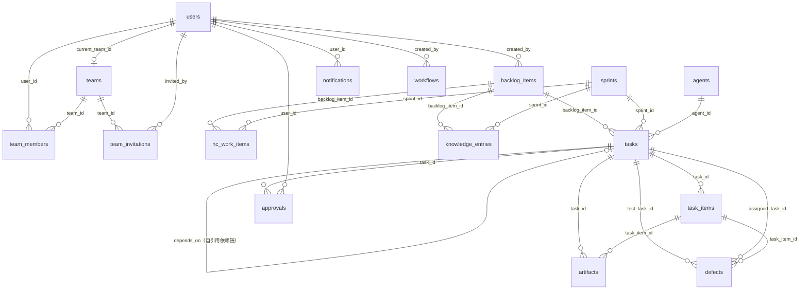
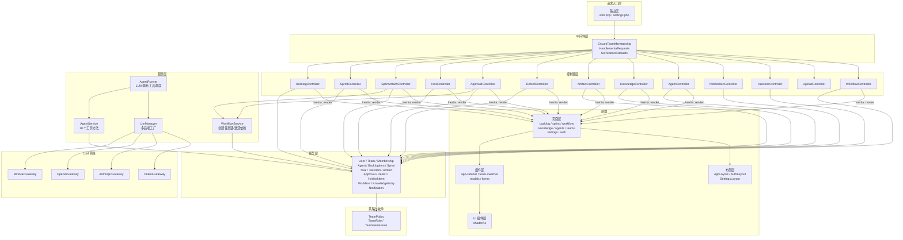

# 项目简介

> **项目名称**：`AgileHub（敏捷中心）`  
> **代码仓库**：`repos/agilehub`  
> **分析日期**：`2026-04-10`  
> **分析人**：Analyst Agent

---

## tech_stack | 技术栈

### 语言与运行时

| 技术 | 版本 | 说明 |
|------|------|------|
| `PHP` | `^8.3` | 后端主要语言 |
| `TypeScript` | `^5.7.2` | 前端主要语言，启用严格类型检查 |
| `Node.js` | — | 前端构建运行时（未显式声明版本，推荐 20+） |

### 核心框架

| 框架 | 版本 | 用途 |
|------|------|------|
| `Laravel` | `^13.0` | 后端 MVC 框架，提供路由、ORM、认证、队列等全套能力 |
| `Laravel Fortify` | `^1.34` | 无头认证后端，提供注册、登录、2FA、密码重置等认证逻辑 |
| `Inertia.js (Laravel)` | `^3.0` | 服务端适配器，实现 Laravel 与 React 的单页应用桥接 |
| `Inertia.js (React)` | `^3.0` | 客户端适配器，在 React 中实现 SPA 路由和数据传递 |
| `React` | `^19.2.0` | 前端 UI 框架 |
| `Tailwind CSS` | `^4.0.0` | 原子化 CSS 框架，用于 UI 样式构建 |
| `Radix UI` | `^1.4.3` | 无样式、可访问的 React UI 原语库（Dialog、Select、Dropdown 等） |
| `Headless UI` | `^2.2.0` | React 无样式组件库（与 Radix UI 互补） |
| `shadcn/ui` | `^4.1.2` | 基于 Radix UI 和 Tailwind 的组件库，提供预构建的 UI 组件 |
| `Vite` | `^8.0.0` | 前端构建工具和开发服务器 |
| `Laravel Wayfinder` | `^0.1.14` | 类型安全的路由生成，从 PHP 路由自动生成 TypeScript 路由函数 |

### 基础设施与中间件

| 组件 | 版本/类型 | 用途 |
|------|----------|------|
| `SQLite` | 默认 | 默认数据库（可切换为 MySQL/PostgreSQL） |
| `Database Session` | Laravel 内置 | 会话存储 |
| `Database Cache` | Laravel 内置 | 缓存驱动 |
| `Database Queue` | Laravel 内置 | 队列驱动，处理异步任务（如邮件通知） |
| `Mail (Log)` | Laravel 内置 | 邮件发送（开发环境默认使用 log 驱动） |
| `Public Disk` | Laravel 内置 | 文件上传存储，按 `attachments/YYYY/MM` 分目录 |

### LLM 集成

| 提供商 | 默认模型 | 说明 |
|--------|---------|------|
| `MiniMax` | `MiniMax-Text-01` | 默认 LLM 提供商，通过环境变量配置 |
| `OpenAI` | `gpt-4o-mini` | 可选 LLM 后端 |
| `Anthropic` | `claude-sonnet-4-20250514` | 可选 LLM 后端 |
| `Ollama` | `llama3.2` | 本地 LLM 后端（默认 fallback） |

### 开发工具链

| 工具 | 版本 | 用途 |
|------|------|------|
| `Pest` | `^4.4` | PHP 测试框架（内含 Laravel 插件） |
| `Laravel Pint` | `^1.27` | PHP 代码风格修复工具（基于 PHP-CS-Fixer） |
| `Laravel Sail` | `^1.53` | Docker 开发环境工具 |
| `Laravel Pail` | `^1.2.5` | 实时日志查看工具 |
| `Laravel Boost` | `^2.0` | 开发体验增强工具 |
| `ESLint` | `^9.17.0` | JavaScript/TypeScript 代码检查 |
| `Prettier` | `^3.4.2` | 代码格式化工具（含 Tailwind CSS 插件） |
| `React Compiler (Babel)` | `^1.0.0` | React 编译器，自动优化组件渲染 |
| `Concurrently` | `^9.0.1` | 并行执行多个开发命令（server/queue/logs/vite） |
| `Lucide React` | `^0.475.0` | 图标库 |
| `HugeIcons` | `^1.1.6` | 图标库（React 绑定 + 免费图标集） |

---

## project_features | 功能说明

### 业务领域

AgileHub 是一款**专为敏捷团队打造的 AI 驱动项目管理工具**，核心特色是通过 **AI Agent 自动化交付链**——从需求分析、设计、编码到测试，由不同类型的 AI Agent（PM、Designer、Dev、Test）按工作流定义自动流转任务、产出制品并进行审批。同时提供完整的**多租户团队管理体系**和**用户认证系统**。

### 核心功能

#### AI Agent 自动化交付（核心创新）

- **Agent 配置管理**：内置 5 类 Agent（HC/PM/Designer/Dev/Test），每个 Agent 有独立的 prompt、工具集和 LLM 配置
- **工作流引擎**：支持自定义工作流步骤，定义 Agent 类型、任务类型、执行顺序、依赖关系及是否需审批
- **Agent Runner**：LLM 驱动的 Agent 执行器，支持 Tool Calling（原生函数调用 + ACTION/PARAMS 文本解析两种模式）
- **Agent 工具集**：提供 10 个内置工具（get_task、submit_artifact、create_defect、notify_agent、search_knowledge 等）
- **LLM 多后端**：通过 Gateway 模式支持 MiniMax、OpenAI、Anthropic、Ollama 四种 LLM 提供商，Agent 级别可独立配置
- **自动产出物提交**：对于不支持 Tool Calling 的模型，自动从 Markdown 响应中提取内容并提交为产出物

#### 需求池管理（Backlog）

- **需求 CRUD**：创建、查看、编辑、删除需求条目
- **优先级分级**：P0（紧急）～ P3（低优先级）四级优先级
- **状态流转**：`pending` → `parsing` → `sprint_planned` → `in_progress` → `done`
- **附件支持**：需求可附加多个文件（JSON 数组存储，通过 Upload 接口上传）
- **筛选与分页**：支持按状态、优先级筛选，分页展示

#### Sprint 迭代管理

- **Sprint 生命周期**：创建（planning）→ 激活（active）→ 结束（ended）
- **需求挂载**：将 Backlog 需求批量挂入 Sprint，自动创建 HcWorkItem 并按工作流生成任务链
- **看板视图**：按任务类型（PM/Designer/Dev/Test）四列展示，每列按状态分组
- **Sprint 结束校验**：结束前检查测试类任务是否全部 `test_approved`
- **知识归档**：Sprint 结束时自动将各需求的交付成果整理为 Markdown 文档写入知识库

#### 任务状态机

- **四类任务**：`pm`（需求分析）、`designer`（设计）、`dev`（开发）、`test`（测试）
- **依赖链**：任务通过 `depends_on` 自引用形成顺序依赖，前置任务审批通过后激活后续任务
- **状态流转规则**（按任务类型不同）：
  - PM/Designer：`pending` → `in_progress` → `awaiting_approval` → `approved`
  - Dev：`pending` → `dev_in_progress` → `dev_self_testing` → `dev_awaiting_approval` → `dev_approved`
  - Test：`pending` → `test_in_progress` → `test_awaiting_approval` → `test_approved`（另有 `test_waiting_fix` → `test_retesting` 循环）
- **子任务（TaskItem）**：任务可拆分为子项，每个子项有独立状态（pending/in_progress/done）和产出物 URL
- **自动推进**：`advance` 接口根据当前状态自动推进到下一合法状态

#### 审批与缺陷

- **审批流**：人工对 Agent 产出物进行审批（approve/reject），审批通过后自动激活依赖任务
- **驳回回滚**：驳回时按状态映射表将任务回滚到对应的工作中状态
- **缺陷管理**：测试阶段创建缺陷，自动关联测试任务和开发任务
- **缺陷生命周期**：`open` → `fixed` → `closed`，支持 `reopen`，状态变更联动测试任务状态

#### 产出物管理（Artifact）

- **五类产出物**：`requirement`（需求文档）、`design`（设计文档）、`code`（代码）、`test_case`（测试用例）、`test_report`（测试报告）
- **任务/子任务级绑定**：产出物归属于 Task，可选关联到 TaskItem
- **内容 + URL**：支持文本内容和文件 URL 两种存储形式

#### 知识库

- **自动归档**：Sprint 结束时按需求分组，自动汇总各阶段 Agent 产出并生成 Markdown 文档
- **检索浏览**：支持标题关键词搜索、按 Backlog 筛选，分页展示
- **详情查看**：展示知识条目正文，关联 BacklogItem 和 Sprint 信息

#### 站内通知

- **通知 CRUD**：分页列表、标记已读、全部已读、未读计数
- **Agent 触发**：Agent 可通过 `notify_human` 工具向用户发送站内通知
- **A2A 消息**：Agent 间通过 `notify_agent` 工具传递消息（当前为占位实现）

#### 用户认证与安全

- **注册/登录**：基于 Laravel Fortify 的完整认证流程，支持邮箱注册、登录
- **双因素认证（2FA）**：支持 TOTP 双因素认证，包含恢复码管理
- **密码管理**：支持密码重置、密码修改，密码使用 Bcrypt（12 轮）加密
- **邮箱验证**：支持注册后的邮箱验证流程
- **用户注册自动建团**：新用户注册时自动创建一个个人团队（Personal Team）

#### 多租户团队管理

- **团队 CRUD**：创建、编辑、删除团队，团队名称自动生成 URL 友好的 slug
- **团队切换**：用户可在多个团队间切换，URL 以 `/{team_slug}/` 为前缀实现团队隔离
- **角色权限体系**：三级角色（Owner > Admin > Member），基于枚举的权限系统
  - **Owner**：拥有全部 7 项权限（更新/删除团队、增删改成员、管理邀请）
  - **Admin**：3 项权限（更新团队、创建/取消邀请）
  - **Member**：无特殊权限
- **成员管理**：更新成员角色、移除成员，基于 Policy 的权限控制
- **邀请机制**：通过邮箱邀请成员加入团队，支持邀请码、过期时间、接受/取消
- **个人团队保护**：个人团队不可删除

#### 用户设置

- **个人资料管理**：编辑姓名、邮箱，支持账户注销
- **安全设置**：修改密码、2FA 管理
- **外观设置**：支持暗色/亮色/跟随系统主题切换

#### 文件上传

- **通用上传接口**：支持 `attachment`（附件）和 `artifact`（产出物）两种类型
- **按年月分目录**：文件存储在 `public` 磁盘的 `attachments/YYYY/MM/` 目录下

### API 概览

| 路径 | 方法 | 功能简述 |
|------|------|---------|
| `/` | GET | 欢迎页（Landing Page） |
| `/{current_team}/dashboard` | GET | 团队 Dashboard（需认证 + 团队成员） |
| `/backlog` | GET | 需求池列表 |
| `/backlog` | POST | 创建需求 |
| `/backlog/{backlog}` | GET | 需求详情 |
| `/backlog/{backlog}` | PUT/PATCH | 更新需求 |
| `/backlog/{backlog}` | DELETE | 删除需求 |
| `/sprints` | GET | Sprint 列表 |
| `/sprints` | POST | 创建 Sprint |
| `/sprints/{sprint}` | GET | Sprint 看板 |
| `/sprints/{sprint}/end` | POST | 结束 Sprint（含知识归档） |
| `/sprints/{sprint}/attach` | POST | 批量挂载需求并生成任务链 |
| `/tasks/{task}/status` | PATCH | 更新任务状态 |
| `/tasks/{task}/advance` | POST | 自动推进任务状态 |
| `/tasks/{task}/approve` | POST | 审批通过 |
| `/tasks/{task}/reject` | POST | 审批驳回 |
| `/workflows` | GET | 工作流列表 |
| `/workflows` | POST | 创建工作流 |
| `/workflows/{workflow}` | PUT/PATCH | 更新工作流 |
| `/workflows/{workflow}` | DELETE | 删除工作流 |
| `/defects` | GET | 缺陷列表 |
| `/defects` | POST | 创建缺陷 |
| `/defects/{defect}` | GET | 缺陷详情 |
| `/defects/{defect}/resolve` | POST | 解决缺陷 |
| `/defects/{defect}/close` | POST | 关闭缺陷 |
| `/defects/{defect}/reopen` | POST | 重开缺陷 |
| `/artifacts` | POST | 创建产出物 |
| `/artifacts/{artifact}` | GET | 产出物详情 |
| `/artifacts/{artifact}` | PUT/PATCH | 更新产出物 |
| `/artifacts/{artifact}` | DELETE | 删除产出物 |
| `/task-items` | POST | 创建子任务 |
| `/task-items/{task_item}` | PUT/PATCH | 更新子任务 |
| `/task-items/{task_item}` | DELETE | 删除子任务 |
| `/knowledge` | GET | 知识库列表（支持搜索） |
| `/knowledge/{knowledge}` | GET | 知识条目详情 |
| `/agents` | GET | Agent 列表 |
| `/agents/{agent}` | PUT/PATCH | 更新 Agent 配置 |
| `/notifications` | GET | 通知列表 |
| `/notifications/unread-count` | GET | 未读通知数 |
| `/notifications/{notification}/read` | POST | 标记已读 |
| `/notifications/read-all` | POST | 全部已读 |
| `/upload` | POST | 文件上传 |
| `/settings/profile` | GET/PATCH | 查看/更新个人资料 |
| `/settings/profile` | DELETE | 注销账户 |
| `/settings/security` | GET | 安全设置页 |
| `/settings/password` | PUT | 更新密码（限流 6次/分钟） |
| `/settings/appearance` | GET | 外观设置页 |
| `/settings/teams` | GET/POST | 团队列表 / 创建团队 |
| `/settings/teams/{team}` | GET/PATCH/DELETE | 查看/更新/删除团队 |
| `/settings/teams/{team}/switch` | POST | 切换当前团队 |
| `/settings/teams/{team}/members/{user}` | PATCH/DELETE | 更新/移除团队成员 |
| `/settings/teams/{team}/invitations` | POST | 发送团队邀请 |
| `/settings/teams/{team}/invitations/{invitation}` | DELETE | 取消团队邀请 |
| `/invitations/{invitation}/accept` | GET | 接受团队邀请 |
| `/dev-plan` | GET | 开发计划（本地看板工具） |

---

## module_structure | 模块划分

### 目录结构

```
agilehub/
└── agile-app/                          # 主应用（Laravel + React）
    ├── app/                            # PHP 后端核心代码
    │   ├── Actions/                    # 业务动作（Action Pattern）
    │   │   ├── Fortify/                # 认证相关动作（创建用户、重置密码）
    │   │   └── Teams/                  # 团队相关动作（创建团队）
    │   ├── Concerns/                   # 可复用 Trait
    │   ├── Enums/                      # 枚举定义（角色、权限）
    │   ├── Http/
    │   │   ├── Controllers/            # 控制器
    │   │   │   ├── Settings/           # 设置相关（Profile、Security）
    │   │   │   ├── Teams/              # 团队相关（Team、Member、Invitation）
    │   │   │   ├── BacklogController   # 需求池管理
    │   │   │   ├── SprintController    # Sprint 迭代管理
    │   │   │   ├── SprintAttachController # Sprint 需求挂载
    │   │   │   ├── TaskController      # 任务状态机
    │   │   │   ├── WorkflowController  # 工作流配置
    │   │   │   ├── AgentController     # Agent 配置管理
    │   │   │   ├── ApprovalController  # 审批流程
    │   │   │   ├── DefectController    # 缺陷管理
    │   │   │   ├── ArtifactController  # 产出物管理
    │   │   │   ├── TaskItemController  # 子任务管理
    │   │   │   ├── KnowledgeController # 知识库
    │   │   │   ├── NotificationController # 站内通知
    │   │   │   └── UploadController    # 文件上传
    │   │   ├── Middleware/             # 中间件
    │   │   ├── Requests/              # 表单请求验证
    │   │   └── Responses/             # 自定义响应
    │   ├── Models/                     # Eloquent 数据模型（12 个业务模型）
    │   ├── Notifications/             # 邮件通知（团队邀请）
    │   ├── Policies/                  # 授权策略（团队权限）
    │   ├── Providers/                 # 服务提供者
    │   ├── Rules/                     # 自定义验证规则
    │   ├── Services/                  # 业务服务层
    │   │   ├── WorkflowService        # 工作流执行（创建任务链、激活依赖）
    │   │   ├── AgentService           # Agent 工具实现（10 个工具方法）
    │   │   ├── AgentRunner            # Agent 执行器（LLM 调用 + 工具解析）
    │   │   └── Llm/                   # LLM 网关层
    │   │       ├── LlmGatewayInterface # 统一接口
    │   │       ├── LlmManager         # 工厂，按 Agent 配置构建 Gateway
    │   │       ├── MiniMaxGateway     # MiniMax API 适配
    │   │       ├── OpenAiGateway      # OpenAI API 适配
    │   │       ├── AnthropicGateway   # Anthropic API 适配
    │   │       └── OllamaGateway      # Ollama 本地模型适配
    │   └── Support/                   # DTO 数据传输对象
    ├── resources/js/                  # React 前端代码
    │   ├── components/                # 业务组件
    │   │   ├── ui/                    # shadcn/ui 基础组件
    │   │   ├── app-sidebar.tsx        # 侧栏导航（工作台 + 配置）
    │   │   ├── team-switcher.tsx      # 团队切换器
    │   │   └── ...                    # 其他业务组件（约 24 个）
    │   ├── hooks/                     # 自定义 React Hooks（9 个）
    │   ├── layouts/                   # 页面布局
    │   │   ├── app-layout.tsx         # 主应用布局
    │   │   ├── app/app-sidebar-layout # Sidebar 布局变体
    │   │   ├── auth-layout.tsx        # 认证页布局
    │   │   └── settings/layout.tsx    # 设置页双栏布局
    │   ├── pages/                     # Inertia 页面组件
    │   │   ├── backlog/               # 需求池页面
    │   │   ├── sprint/                # Sprint 列表 + 看板
    │   │   ├── workflow/              # 工作流配置
    │   │   ├── knowledge/             # 知识库（列表 + 详情）
    │   │   ├── agents/                # Agent 配置
    │   │   ├── auth/                  # 认证页面
    │   │   ├── settings/              # 设置页面
    │   │   ├── teams/                 # 团队页面
    │   │   ├── dashboard.tsx          # Dashboard（占位）
    │   │   └── dev-plan.tsx           # 本地开发计划看板
    │   ├── types/                     # TypeScript 类型定义
    │   └── lib/                       # 工具函数
    ├── routes/                        # 路由定义
    │   ├── web.php                    # 主路由（业务 + 认证）
    │   ├── settings.php               # 设置路由
    │   └── dev-plan.php               # 开发计划路由
    ├── database/
    │   ├── migrations/                # 数据库迁移（19 个）
    │   ├── factories/                 # 模型工厂（User、Team、TeamInvitation）
    │   └── seeders/                   # 种子数据（用户 + 5 类 Agent）
    ├── config/                        # 应用配置
    ├── tests/                         # 测试（Pest）
    └── public/                        # 静态资源入口
```

### 数据模型



### 模块职责

| 模块/目录 | 职责 | 核心文件 |
|-----------|------|---------|
| `app/Services/Llm/` | LLM 网关层，统一多后端调用接口 | `LlmManager.php`（工厂）, `LlmGatewayInterface.php`（接口） |
| `app/Services/AgentRunner.php` | Agent 执行器，驱动 LLM 调用、工具解析、产出物提交 | 支持原生 Tool Calling 和 ACTION/PARAMS 文本解析 |
| `app/Services/AgentService.php` | Agent 工具实现层，提供 10 个工具方法供 AgentRunner 调度 | `getTask`, `submitArtifact`, `createDefect` 等 |
| `app/Services/WorkflowService.php` | 工作流执行引擎 | `createTasksFromWorkflow`（创建任务链）, `activateDependantTasks`（激活依赖） |
| `app/Http/Controllers/` | 处理 HTTP 请求，返回 Inertia/JSON 响应 | 15 个业务控制器 |
| `app/Actions/` | 封装独立的业务操作（Action Pattern） | `CreateTeam.php`, `CreateNewUser.php` |
| `app/Concerns/` | 可复用的 Trait，为 Model 提供扩展能力 | `HasTeams.php`（团队关联与权限查询） |
| `app/Enums/` | 枚举定义，确保类型安全 | `TeamRole.php`（角色层级与权限映射）, `TeamPermission.php` |
| `app/Models/` | Eloquent ORM 数据模型 | 12 个业务模型（详见数据模型图） |
| `app/Policies/` | 基于 Gate 的授权策略 | `TeamPolicy.php`（7 项团队权限校验） |
| `app/Support/` | DTO 数据传输对象 | `UserTeam.php`, `TeamPermissions.php` |
| `app/Http/Middleware/` | 请求中间件 | `EnsureTeamMembership.php`, `SetTeamUrlDefaults.php`, `HandleInertiaRequests.php`, `HandleAppearance.php` |
| `resources/js/pages/` | Inertia 页面组件，对应服务端路由 | 22 个页面文件 |
| `resources/js/components/` | 可复用的 React 组件 | 约 24 个业务组件 + shadcn/ui 基础组件 |
| `resources/js/layouts/` | 页面布局（Sidebar/Header/Auth/Settings 四种） | `app-layout.tsx`, `auth-layout.tsx`, `settings/layout.tsx` |
| `resources/js/hooks/` | 自定义 React Hooks | `use-appearance.tsx`, `use-two-factor-auth.ts` 等 9 个 |
| `routes/` | 路由定义 | `web.php`（主路由 + 业务路由）, `settings.php`, `dev-plan.php` |
| `database/migrations/` | 数据库结构定义 | 19 个迁移文件，覆盖 12 张业务表 |
| `database/seeders/` | 种子数据 | `DatabaseSeeder.php`（测试用户）, `AgentSeeder.php`（5 类 Agent 预配置） |

### 模块依赖关系



---

## 部署与运行

### 运行方式

**一键初始化：**

```bash
composer setup
```

该命令依次执行：`composer install` → 复制 `.env` → 生成密钥 → 数据库迁移 → `npm install` → `npm run build`

**开发模式（并行启动 4 个服务）：**

```bash
composer dev
```

同时启动：PHP 内置服务器 + 队列监听器 + Pail 日志查看器 + Vite 开发服务器

**构建生产包：**

```bash
npm run build       # 客户端渲染
npm run build:ssr   # 支持 SSR
```

**代码质量检查：**

```bash
composer ci:check   # ESLint + Prettier + TypeScript + Pint + Pest 全量检查
composer test       # PHP 代码风格检查 + 测试
npm run lint        # ESLint 修复
npm run format      # Prettier 格式化
```

### 环境依赖

| 依赖 | 要求 | 说明 |
|------|------|------|
| `PHP` | `^8.3` | 后端运行时 |
| `Composer` | 最新版 | PHP 依赖管理 |
| `Node.js` | 兼容 Vite 8 | 前端构建（推荐 20+） |
| `SQLite` | 系统内置 | 默认数据库（零配置） |

### LLM 配置（可选）

Agent 功能需要配置至少一个 LLM 提供商。通过 Agent 种子数据（`AgentSeeder`）中的 `llm_config` 或环境变量配置：

| 环境变量 | 说明 |
|---------|------|
| `LLM_PROVIDER` | LLM 提供商（`minimax` / `openai` / `anthropic` / `ollama`），默认 `ollama` |
| `MINIMAX_API_KEY` | MiniMax API 密钥 |
| `MINIMAX_API_BASE` | MiniMax API 地址 |
| `LLM_MODEL` | MiniMax 默认模型名 |
| `OPENAI_API_KEY` | OpenAI API 密钥 |
| `ANTHROPIC_API_KEY` | Anthropic API 密钥 |
| `OLLAMA_BASE_URL` | Ollama 服务地址，默认 `http://localhost:11434` |
| `OLLAMA_MODEL` | Ollama 模型名，默认 `llama3.2` |

---

## 注意事项

- **Dashboard 为空壳状态**：当前 Dashboard 页面仅展示占位符（PlaceholderPattern），核心的看板和迭代追踪入口通过侧边栏导航到独立页面
- **Welcome 页面保留 Laravel 默认模板**：Landing Page 尚未替换为项目自定义内容
- **前端页面缺口**：`BacklogController.show` 渲染 `backlog/show` 页面，但前端仅有 `backlog/index.tsx`，缺少 `backlog/show.tsx`，访问需求详情页可能报错
- **业务数据无团队隔离**：所有业务表（backlog_items、tasks、sprints 等）在数据库层面无 `team_id` 外键，数据隔离需在应用层实现（当前未发现隔离逻辑）
- **个人团队自动创建**：新用户注册时自动创建个人团队并设为当前团队，这是系统的核心设计假设
- **软删除**：团队使用软删除（SoftDeletes），删除后数据仍保留在数据库中
- **团队 URL 路由**：团队上下文通过 URL 前缀 `/{team_slug}/` 传递，中间件自动处理团队切换
- **权限模型无数据库持久化**：角色权限定义在枚举中（非数据库表），修改权限需要改代码
- **邀请码为 64 位随机字符串**：邀请通过 code 字段做路由键，非 ID
- **Agent 种子数据依赖环境变量**：`AgentSeeder` 从 `MINIMAX_*` 环境变量读取 LLM 配置，未配置时 Agent 功能不可用
- **A2A 消息为占位实现**：`notifyAgent` 方法当前仅返回成功结果，未接入实际的消息队列
- **业务 Factory 未覆盖**：仅 User、Team、TeamInvitation 有 Factory，业务表（Agent、BacklogItem、Task 等）无测试工厂
- **领域类型未统一沉淀**：Backlog、Sprint、Task 等前端类型定义分散在各页面的 `interface` 中，未提取到 `types/` 目录

---

## 变更记录

| 日期 | 版本 | 变更内容 | 变更人 |
|------|------|---------|-------|
| 2026-04-09 | v1.0 | 初始分析：认证系统、多租户团队管理 | Analyst Agent |
| 2026-04-10 | v2.0 | 重大更新：新增 AI Agent 交付链、需求池、Sprint、工作流、任务状态机、审批、缺陷、产出物、知识库、通知、文件上传、LLM 多后端集成等完整敏捷交付模块 | Analyst Agent |
