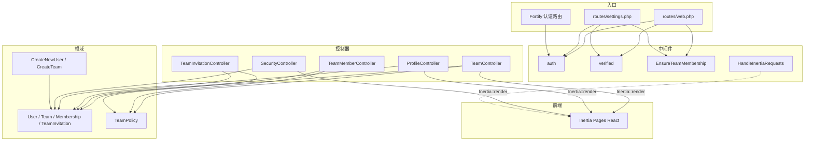

# 项目简介

> **项目名称**：`Content Hub（内容中心底座应用）`  
> **代码仓库**：`repos/content-hub`  
> **分析日期**：`2026-05-07`  
> **分析人**：Analyst Agent

---

## tech_stack | 技术栈

### 语言与运行时

| 技术 | 版本 | 说明 |
|------|------|------|
| `PHP` | `^8.3` | 后端语言（`composer.json`） |
| `TypeScript` | `^5.7.2` | 前端类型与构建（`package.json`） |
| `Node.js` | — | 前端构建与开发服务器（脚本使用 `npm` / `npx`，未在仓库中锁定 Node 主版本） |

### 核心框架

| 框架 | 版本 | 用途 |
|------|------|------|
| `Laravel Framework` | `^13.7` | Web 框架、路由、ORM、队列、缓存、会话等 |
| `Laravel Fortify` | `^1.34` | 无头认证：注册、登录、密码重置、邮箱验证、双因素认证 |
| `Inertia.js (Laravel)` | `^3.0` | 服务端适配器，连接 Laravel 与 React SPA |
| `Inertia.js (React)` | `^3.0` | 客户端适配器 |
| `React` | `^19.2.0` | UI 框架 |
| `Tailwind CSS` | `^4.0.0` | 样式（`@tailwindcss/vite`） |
| `Radix UI` / `Headless UI` | 见 `package.json` | 无样式可访问组件原语 |
| `shadcn` | `^4.7.0` | 基于 Radix + Tailwind 的组件体系 |
| `Vite` | `^8.0.0` | 前端构建与 HMR |
| `Laravel Wayfinder` | `^0.1.14` | 自 PHP 路由生成类型安全的 TS 路由辅助 |

### 基础设施与中间件

| 组件 | 版本/类型 | 用途 |
|------|----------|------|
| `SQLite` | 默认（`.env.example`） | 默认数据库连接 |
| `Database Session` | Laravel 内置 | `SESSION_DRIVER=database` |
| `Database Cache` | Laravel 内置 | `CACHE_STORE=database` |
| `Database Queue` | Laravel 内置 | `QUEUE_CONNECTION=database` |
| `Mail (Log)` | Laravel 内置 | 开发环境邮件 `MAIL_MAILER=log` |

### 开发工具链

| 工具 | 版本 | 用途 |
|------|------|------|
| `Pest` | `^4.7` | PHP 测试（含 Laravel 插件） |
| `Laravel Pint` | `^1.27` | PHP 代码风格 |
| `Laravel Sail` | `^1.53` | Docker 本地环境（可选） |
| `Laravel Pail` | `^1.2.5` | 实时日志 |
| `Laravel Boost` | `^2.2` | 开发体验增强 |
| `ESLint` | `^9.17.0` | TS/JS Lint（`eslint.config.js`） |
| `Prettier` | `^3.4.2` | 格式化（含 Tailwind 插件） |
| `Concurrently` | `^9.0.1` | `composer dev` 并行启动多进程 |

---

## project_features | 功能说明

### 业务领域

代码库在架构上对齐 **Laravel 官方 React Starter Kit**（`composer.json` 中 `name` 仍为 `laravel/react-starter-kit`），并扩展了 **多团队（多租户 URL 前缀）** 与 **Fortify 全链路认证**。当前路由与数据模型中 **未发现** 与「内容资产、CMS、媒体库」等相关的业务域实现；`Dashboard` 为占位 UI。仓库名 `content-hub` 所指向的产品愿景若在后续迭代中落地，需在业务层新增对应模块。

### 核心功能

#### 用户认证与安全（Fortify + Inertia）

- **注册 / 登录**：Fortify 提供端点，视图由 Inertia 渲染为 React 页面（`resources/js/pages/auth/*`）
- **密码重置**：忘记密码、重置密码流程
- **邮箱验证**：Fortify 配置中启用了 `emailVerification`；路由上使用了 `verified` 中间件。`User` 模型当前 **未** 实现 `MustVerifyEmail` 接口（源码中为注释状态），与严格验邮语义可能不完全一致，详见「注意事项」
- **双因素认证（2FA）**：启用确认流程与确认密码（`config/fortify.php`）
- **登录/注册后重定向**：自定义 `LoginResponse` / `RegisterResponse`，将用户带到 `/{team_slug}/dashboard` 并设置 URL 默认参数 `current_team`

#### 多租户团队管理

- **团队数据模型**：`teams`（含 `slug`、`is_personal`、软删除）、`team_members`（角色字符串）、`team_invitations`（`code`、邮箱、角色、过期与接受时间）
- **用户当前团队**：`users.current_team_id` 外键
- **注册自动建团**：`CreateNewUser` 在事务中创建用户后调用 `CreateTeam`，创建 **个人团队**（`is_personal: true`）
- **团队 CRUD 与切换**：设置路由下团队的列表、创建、编辑、删除、切换当前团队
- **成员与邀请**：更新/移除成员；创建/取消邀请；接受邀请（`invitations/{invitation}/accept`）
- **角色与权限**：`TeamRole`（Owner / Admin / Member）与 `TeamPermission` 枚举；`TeamPolicy` 做授权；Owner 拥有全部列出的团队权限，Admin 为子集，Member 无额外权限

#### 用户设置

- **个人资料**：查看与更新；账户删除（需 `verified`）
- **安全**：安全页、密码更新（带 `throttle:6,1` 限流）
- **外观**：明暗色/系统主题（`settings/appearance` Inertia 页）

#### 应用壳与 Dashboard

- **欢迎页**：`/` → Inertia `welcome`
- **团队上下文下的 Dashboard**：`/{current_team}/dashboard` → `dashboard.tsx`，当前为 **占位栅格**（`PlaceholderPattern`），无业务数据展示

### API 概览（Web 路由）

以下为 `routes/web.php` 与 `routes/settings.php` 中的主要 HTTP 面（Fortify 还会在相同应用中注册认证相关 POST/GET 路由，此处不逐项展开）。

| 路径 | 方法 | 功能简述 |
|------|------|---------|
| `/` | GET | 欢迎页（Inertia） |
| `/{current_team}/dashboard` | GET | Dashboard（需登录、已验证邮箱、`EnsureTeamMembership`） |
| `invitations/{invitation}/accept` | GET | 接受团队邀请（需登录） |
| `settings/profile` | GET / PATCH | 个人资料 |
| `settings/profile` | DELETE | 注销账户（需 `verified`） |
| `settings/security` | GET | 安全设置页 |
| `settings/password` | PUT | 更新密码（限流） |
| `settings/appearance` | GET | 外观设置（Inertia） |
| `settings/teams` | GET / POST | 团队列表 / 创建团队 |
| `settings/teams/{team}` | GET / PATCH / DELETE | 团队详情、更新、删除（成员中间件内） |
| `settings/teams/{team}/switch` | POST | 切换当前团队 |
| `settings/teams/{team}/members/{user}` | PATCH / DELETE | 更新角色 / 移除成员 |
| `settings/teams/{team}/invitations` | POST | 发送邀请 |
| `settings/teams/{team}/invitations/{invitation}` | DELETE | 取消邀请 |

---

## module_structure | 模块划分

### 目录结构

```
content-hub/
├── app/
│   ├── Actions/
│   │   ├── Fortify/              # Fortify：创建用户、重置密码
│   │   └── Teams/                # CreateTeam 等团队动作
│   ├── Concerns/                 # HasTeams、校验规则 Trait、团队 slug 生成
│   ├── Enums/                    # TeamRole、TeamPermission
│   ├── Http/
│   │   ├── Controllers/
│   │   │   ├── Settings/         # Profile、Security
│   │   │   └── Teams/            # Team、Member、Invitation
│   │   ├── Middleware/           # EnsureTeamMembership、HandleInertiaRequests、HandleAppearance、SetTeamUrlDefaults
│   │   ├── Requests/             # 表单请求验证（Settings / Teams）
│   │   └── Responses/          # Login / Register / TwoFactor 登录后重定向
│   ├── Models/                   # User、Team、Membership、TeamInvitation
│   ├── Notifications/Teams/      # 团队邀请通知
│   ├── Policies/                 # TeamPolicy
│   ├── Providers/                # App、Fortify
│   ├── Rules/                    # 团队名校验、邀请唯一性等
│   └── Support/                  # UserTeam、TeamPermissions 等 DTO
├── bootstrap/
├── config/
├── database/
│   └── migrations/               # users、cache、jobs、2FA 列、teams 相关表
├── public/
├── resources/js/                 # React + Inertia 页面与组件
│   ├── components/               # 布局、侧栏、团队模态框、shadcn/ui
│   ├── hooks/
│   ├── layouts/
│   ├── pages/                    # welcome、auth、dashboard、settings、teams
│   └── types/
├── routes/
│   ├── web.php
│   └── settings.php
├── tests/
├── composer.json
├── package.json
└── vite.config.ts
```

### 模块职责

| 模块/目录 | 职责 | 核心文件 |
|-----------|------|---------|
| `app/Actions/Fortify` | 注册时创建用户与个人团队 | `CreateNewUser.php` |
| `app/Actions/Teams` | 创建团队等业务动作 | `CreateTeam.php` |
| `app/Concerns/HasTeams` | User 上的团队关系、当前团队、个人团队查询 | `HasTeams.php` |
| `app/Http/Middleware/EnsureTeamMembership` | 校验当前用户是否属于 URL 中的 `current_team` | `EnsureTeamMembership.php` |
| `app/Http/Middleware/SetTeamUrlDefaults` | 为路由 URL 生成设置 `current_team` 默认值 | `SetTeamUrlDefaults.php` |
| `app/Http/Controllers/Teams/*` | 团队、成员、邀请的 HTTP 处理 | `TeamController.php` 等 |
| `app/Policies/TeamPolicy.php` | 团队级授权（更新、删除、成员、邀请） | 与 `TeamPermission` 配合 |
| `resources/js/pages` | Inertia 页面：认证、仪表盘占位、设置、团队 | 各 `*.tsx` |
| `routes/web.php` | 首页、团队前缀下的 dashboard、邀请接受 | — |
| `routes/settings.php` | 设置与团队管理路由分组 | — |

### 模块依赖关系



---

## 部署与运行

### 运行方式

**一键初始化（`composer.json` scripts）：**

```bash
composer setup
```

依次：`composer install` → 若无 `.env` 则复制 `.env.example` → `key:generate` → `migrate --force` → `npm install` → `npm run build`。

**本地开发（并行：HTTP、队列、日志、Vite）：**

```bash
composer dev
```

**质量与测试：**

```bash
composer ci:check    # 前端 lint/format/types + PHPUnit/Pest
composer test        # Pint 检查 + artisan test
npm run dev          # 仅 Vite（若自行启动 `php artisan serve`）
```

### 环境依赖

| 依赖 | 要求 | 说明 |
|------|------|------|
| `PHP` | `^8.3` | 运行时 |
| `Composer` | 兼容 Laravel 13 | PHP 依赖 |
| `Node` + `npm` | 与 Vite 8 兼容 | 仓库脚本以 `npm` 为主；存在 `pnpm-lock.yaml` 与 `pnpm-workspace.yaml`（主要用于 hoist 配置），日常 `composer` 脚本仍调用 `npm` |
| `SQLite` 或其他 DB | 按 `.env` | 默认示例为 SQLite |

---

## 注意事项

- **composer 包名仍为 starter kit**：`composer.json` 的 `name` 为 `laravel/react-starter-kit`，与仓库对外名称 `content-hub` 不一致，集成文档时建议以 Git 远程仓库名为准。
- **Dashboard 无业务内容**：仅为占位组件，后续「内容中心」能力需新增路由、模型与页面。
- **Fortify `home` 配置为 `/dashboard`**：实际登录成功跳转由自定义 Response 拼接为 `/{slug}/dashboard`；直接访问未带团队前缀的 `/dashboard` 行为依赖全局路由表，团队 slug 由中间件与 `URL::defaults` 维护。
- **邮箱验证与模型接口不一致**：`User` 中对 `Illuminate\Contracts\Auth\MustVerifyEmail` 的引用处于注释状态，模型未实现该接口；但 `config/fortify.php` 仍启用了 `Features::emailVerification()`，且 `web.php` / `settings.php` 部分路由使用 `verified` 中间件。`ProfileController` 向前端传递的 `mustVerifyEmail` 依赖 `instanceof MustVerifyEmail`，当前恒为不展示「必须验邮」语义。若产品要求严格验邮，需恢复接口实现并与测试（如 `EmailVerificationTest`）对齐。
- **权限为代码内枚举**：非数据库驱动的 RBAC 表，变更权限需改 PHP 枚举与 Policy。
- **个人团队**：注册时创建，`CreateTeam` 带 `isPersonal` 标记；删除团队等规则以 `TeamPolicy` 与请求验证为准。

---

## 变更记录

| 日期 | 版本 | 变更内容 | 变更人 |
|------|------|---------|-------|
| 2026-05-07 | v1.0 | 基于 `repos/content-hub` 代码扫描的初始项目简介 | Analyst Agent |
