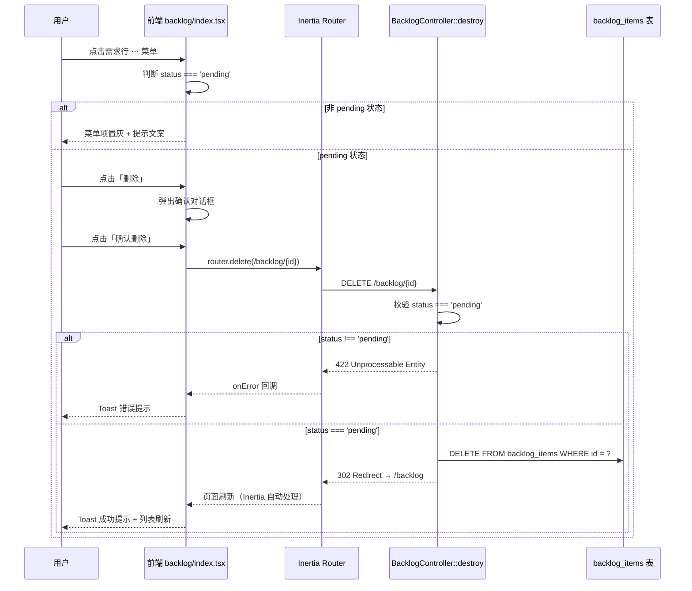

# 技术设计文档

> **需求编号**：FEAT-001  
> **需求名称**：Backlog 列表删除功能  
> **创建日期**：2026-04-10  
> **负责人**：Developer  
> **关联 PRD**：`workflow/features/FEAT-001-backlog-delete/prd.md`  
> **状态**：已定稿

---

## architecture | 架构设计

### 整体方案

本需求为 **纯前端交互增强 + 后端安全加固**，不涉及新增 API 端点或数据模型变更。核心思路：

1. **后端加固**：在已有的 `BacklogController::destroy` 方法中增加状态校验，仅允许删除 `pending` 状态的需求，防止 API 层面的越权删除
2. **前端补齐**：在 Backlog 列表页的每行卡片上增加操作菜单（DropdownMenu），暴露「删除」入口，通过确认对话框（Dialog）保障操作安全，通过 Toast 提供操作反馈

选择此方案的原因：
- **复用已有基础设施**：后端 `DELETE /backlog/{backlog}` 接口已存在，Wayfinder 路由辅助函数（`@/routes/backlog` 中的 `destroy`）已生成，UI 组件库（DropdownMenu、Dialog）已就绪，Toast 系统（`use-toast.ts`）已可用
- **最小变更原则**：不引入新的数据库迁移、新的 API 端点或新的第三方依赖，降低风险
- **前后端双重防线**：前端通过 UI 状态控制约束用户操作，后端通过业务校验兜底安全

### 架构图



### 模块划分

| 模块 | 职责 | 技术选型 | 说明 |
|------|------|---------|------|
| `BacklogController::destroy` | 后端删除逻辑，增加状态校验 | Laravel Controller | 复用已有控制器，仅需增加 3-5 行校验代码 |
| `backlog/index.tsx` — DropdownMenu | 每行卡片的操作菜单 | Radix UI DropdownMenu（shadcn/ui 封装） | 项目已有完整的 DropdownMenu 组件，直接使用 |
| `backlog/index.tsx` — DeleteDialog | 删除确认对话框 | Radix UI Dialog（shadcn/ui 封装） | 复用项目中 Dialog 组件，参考 `delete-team-modal.tsx` 的交互模式 |
| `backlog/index.tsx` — Toast | 操作结果反馈 | 自定义 `use-toast.ts` | 项目已有 toast 系统，支持 `default` 和 `destructive` 两种样式 |

### 设计决策

| 决策 | 方案 | 备选方案 | 选择理由 |
|------|------|---------|---------|
| 操作入口形式 | DropdownMenu（⋯ 按钮） | 行内直接放删除按钮 | PRD 明确要求「操作菜单（"⋯" 按钮）」；DropdownMenu 可扩展后续操作（编辑、查看等），且项目组件库已有该组件 |
| 非 pending 项的处理 | 菜单项置灰 + 提示文案 | 完全隐藏删除选项 | PRD 允许「置灰并附带提示文案，或直接隐藏」，选择置灰方式让用户理解约束原因，降低认知成本 |
| 确认对话框实现 | Dialog 组件 + 显示需求标题 | 浏览器原生 `confirm()` | Dialog 组件可定制样式和内容，与项目整体 UI 风格一致；`workflow/index.tsx` 中用的 `confirm()` 过于简陋 |
| 删除后响应方式 | `redirect('/backlog')` | `Inertia::render('backlog/index', ...)` | 当前 destroy 方法直接 render 会丢失 URL 参数（筛选、分页），redirect 让 Inertia 重新 visit 列表页，自动保留当前 URL 状态 |
| 后端错误响应 | 返回 422 + `back()->withErrors()` | 返回 JSON 错误 | 项目使用 Inertia.js，错误通过 `withErrors` 传递到前端 `page.props.errors`，是 Laravel + Inertia 的标准错误处理模式 |
| 前端路由调用方式 | `router.delete(destroy.url(id))` | 直接拼接字符串 `/backlog/${id}` | 项目已使用 Laravel Wayfinder 生成类型安全的路由函数，保持一致性 |

---

## api_design | API 设计

### 接口 1：删除 Backlog 需求（已有接口，增强校验）

- **方法**：`DELETE`
- **路径**：`/backlog/{backlog}`
- **描述**：删除指定的 Backlog 需求条目。仅允许删除状态为 `pending` 的需求。

**请求参数**：

| 参数 | 类型 | 必填 | 描述 |
|------|------|------|------|
| `backlog` | `integer` | 是 | Backlog 需求 ID（URL 路径参数，Laravel 路由模型绑定） |

**请求体**：无

**成功响应**（302 Redirect）：

```
HTTP/1.1 302 Found
Location: /backlog
```

Inertia.js 自动处理 302 重定向，前端页面将自动刷新并获取最新数据。

**错误响应**（422 Unprocessable Entity）：

```json
{
  "message": "仅待处理状态的需求可删除",
  "errors": {
    "status": ["仅待处理状态的需求可删除"]
  }
}
```

**错误码**：

| HTTP 状态码 | 描述 | 触发条件 |
|------------|------|---------|
| `302` | 删除成功，重定向到列表页 | 需求状态为 `pending` 且删除成功 |
| `401` | 未认证 | 用户未登录（auth 中间件拦截） |
| `404` | 资源不存在 | `backlog` ID 对应的记录不存在（Laravel 路由模型绑定自动处理） |
| `422` | 业务校验失败 | 需求状态不是 `pending`（新增校验） |
| `500` | 服务器内部错误 | 数据库操作异常（如外键约束导致的级联删除失败） |

---

## data_model | 数据模型

### 实体：`backlog_items`（已有，无变更）

本需求不涉及数据模型变更。以下为现有表结构参考：

| 字段 | 类型 | 约束 | 描述 |
|------|------|------|------|
| `id` | `bigint` | `PK, AUTO_INCREMENT` | 主键 |
| `title` | `varchar(255)` | `NOT NULL` | 需求标题 |
| `description` | `text` | `NULLABLE` | 需求描述 |
| `attachments` | `json` | `NULLABLE` | 附件列表（JSON 数组） |
| `priority` | `enum('P0','P1','P2','P3')` | `DEFAULT 'P2'` | 优先级 |
| `status` | `enum('pending','parsing','sprint_planned','in_progress','done')` | `DEFAULT 'pending'` | 状态（**删除校验依据**） |
| `created_by` | `bigint` | `FK → users.id, ON DELETE CASCADE` | 创建者 |
| `created_at` | `datetime` | `NOT NULL` | 创建时间 |
| `updated_at` | `datetime` | `NOT NULL` | 更新时间 |

**索引**：

| 索引名 | 字段 | 类型 | 用途 |
|-------|------|------|------|
| `backlog_items_status_index` | `status` | `INDEX` | 状态筛选查询加速 |
| `backlog_items_priority_index` | `priority` | `INDEX` | 优先级筛选查询加速 |

**关联实体影响分析**：

| 关联表 | 关系 | 删除时影响 | 处理方式 |
|--------|------|-----------|---------|
| `tasks` | `backlog_item_id` FK | 删除 backlog 项会影响关联任务 | 仅 `pending` 状态可删除，此时不应存在关联任务；后端校验兜底 |
| `hc_work_items` | `backlog_item_id` FK | 删除 backlog 项会影响关联工作项 | 同上，`pending` 状态不会有已挂入 Sprint 的工作项 |
| `knowledge_entries` | `backlog_item_id` FK | 删除 backlog 项会影响知识条目 | 同上，`pending` 状态不会有知识归档 |

> **[待确认]**：当前 `tasks`、`hc_work_items`、`knowledge_entries` 表的外键是否设置了 `ON DELETE CASCADE`？如果是 `RESTRICT`，即使通过了 `pending` 状态校验，在极端情况下（如存在脏数据）删除仍可能因外键约束而失败。建议在后端用 try-catch 捕获此类异常并返回友好错误。

---

## 实现计划

### 任务拆分

| 任务 ID | 任务描述 | 预估工时 | 优先级 | 依赖 | 涉及文件 |
|---------|---------|---------|-------|------|---------|
| T1 | **后端：`destroy` 方法增加状态校验** — 在 `BacklogController::destroy` 中增加 `status !== 'pending'` 判断，不满足时返回 422；将 `Inertia::render` 改为 `redirect('/backlog')` | 0.5h | P0 | 无 | `app/Http/Controllers/BacklogController.php` |
| T2 | **前端：Backlog 列表项增加操作菜单** — 在每行 Card 的标题区域右侧增加 DropdownMenu（⋯ 触发按钮），包含「删除」菜单项；非 `pending` 状态时置灰并显示提示 | 1h | P0 | 无 | `resources/js/pages/backlog/index.tsx` |
| T3 | **前端：实现删除确认对话框** — 创建确认 Dialog，显示需求标题和确认提示文案；点击「确认删除」时调用 `router.delete(destroy.url(id))`；处理 loading 状态 | 1h | P0 | T2 | `resources/js/pages/backlog/index.tsx` |
| T4 | **前端：集成 Toast 通知** — 删除成功后显示「需求已删除」；删除失败时显示「删除失败，请稍后重试」；使用 `onSuccess` / `onError` 回调触发 | 0.5h | P0 | T3 | `resources/js/pages/backlog/index.tsx` |
| T5 | **联调与自测** — 验证所有验收标准（AC-1 ~ AC-5）；测试分页/筛选状态下的删除表现；测试并发和边界场景 | 0.5h | P1 | T1 ~ T4 | — |

**总计预估**：3.5 小时

### 各任务实现要点

#### T1：后端状态校验

**修改文件**：`app/Http/Controllers/BacklogController.php`

修改 `destroy` 方法，在执行删除前增加状态检查：

```php
public function destroy(BacklogItem $backlog)
{
    if ($backlog->status !== 'pending') {
        return back()->withErrors([
            'status' => '仅待处理状态的需求可删除',
        ]);
    }

    $backlog->delete();

    return redirect('/backlog');
}
```

要点：
- 使用 `back()->withErrors()` 而非 `abort(422)`，确保 Inertia 能正确处理错误
- 使用 `redirect('/backlog')` 替换现有的 `Inertia::render()`，让列表页正常刷新并保留分页状态

#### T2：操作菜单

**修改文件**：`resources/js/pages/backlog/index.tsx`

在 Card 组件的标题行右侧增加 DropdownMenu：

```tsx
import {
  DropdownMenu,
  DropdownMenuContent,
  DropdownMenuItem,
  DropdownMenuTrigger,
} from '@/components/ui/dropdown-menu';
import { MoreHorizontal, Trash2 } from 'lucide-react';
```

要点：
- ⋯ 按钮使用 `MoreHorizontal` 图标（Lucide 已在项目中使用）
- 点击 ⋯ 按钮时需阻止事件冒泡（`e.stopPropagation()`），防止触发 Card 的展开/收起
- 非 `pending` 状态的需求，菜单项设置 `disabled` 属性，并保留视觉提示

#### T3：删除确认对话框

**修改文件**：`resources/js/pages/backlog/index.tsx`

参考 `delete-team-modal.tsx` 的对话框模式，在页面组件内实现：

```tsx
// 状态管理
const [deleteTarget, setDeleteTarget] = useState<BacklogItem | null>(null);
const [deleting, setDeleting] = useState(false);
```

对话框内容：
- 标题：「确认删除」
- 描述：「确认要删除需求"**{title}**"吗？删除后不可恢复。」
- 按钮：「取消」(secondary) + 「确认删除」(destructive)
- 确认删除按钮在请求进行中显示 loading 状态并禁用

#### T4：Toast 集成

**修改文件**：`resources/js/pages/backlog/index.tsx`

```tsx
import { toast } from '@/hooks/use-toast';

// 在 router.delete 的回调中
router.delete(destroy.url(deleteTarget.id), {
  onSuccess: () => {
    toast({ title: '需求已删除' });
  },
  onError: () => {
    toast({ title: '删除失败，请稍后重试', variant: 'destructive' });
  },
  onFinish: () => {
    setDeleteTarget(null);
    setDeleting(false);
  },
});
```

### 技术风险

| 风险 | 概率 | 影响 | 缓解措施 |
|------|------|------|---------|
| 外键约束导致删除失败 | 低 | 用户看到 500 错误 | 后端 `destroy` 方法增加 try-catch，捕获 `QueryException` 后返回友好错误提示 |
| 并发场景：用户 A 打开确认框期间，用户 B 将需求状态推进 | 低 | 前端允许点击删除，但后端拒绝 | 后端校验兜底，前端 `onError` 回调正确处理 422 错误并提示用户 |
| Toast 系统在某些布局下不显示 | 低 | 用户无操作反馈 | 确认 `app-layout.tsx` 中是否有 Toast 容器渲染；如无则需补充 |
| 分页边界：删除最后一页的最后一条数据后分页异常 | 中 | 页面显示空列表但分页控件仍显示上一页 | 使用 `redirect('/backlog')` 回到列表首页，由 Laravel 分页器自动处理 |

---

## 变更记录

| 日期 | 版本 | 变更内容 | 变更人 |
|------|------|---------|-------|
| 2026-04-10 | v1.0 | 初始版本 | Developer |
