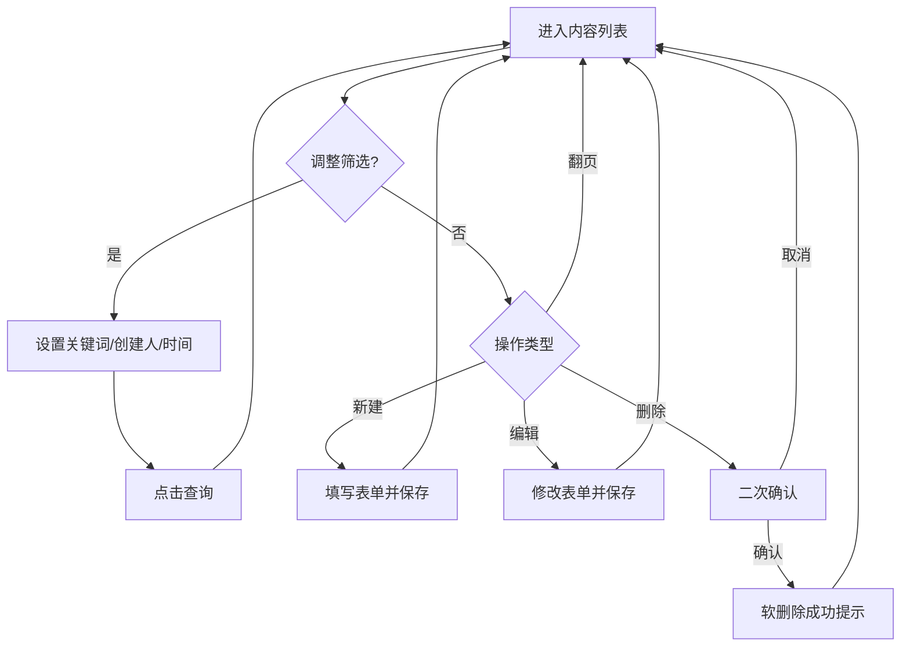

# 产品需求文档（PRD）

> **需求编号**：FEAT-002  
> **需求名称**：Content Hub 基础内容列表与 CRUD（V1）  
> **关联仓库**：`repos/content-hub`（参见 `docs/projects/content-hub/overview.md`）  
> **创建日期**：2026-05-07  
> **负责人**：产品经理  
> **状态**：已定稿（V1 范围，含线框级交互原型 v1.2）

---

## overview | 需求概述

### 背景

Content Hub 定位为面向营销与运营场景的**内容创作与管理中心**：提供 Web 管理端，并在后续版本提供开放接口供外部系统调用；内容在后台需按**团队（team）**隔离，与现有 Laravel 应用中 `/{current_team}/` 团队上下文及 `EnsureTeamMembership` 等多租户机制对齐（见项目简介「多租户团队管理」）。

产品愿景包括：按**投放渠道**（如 PUSH、文本短信、富文本短信）管理差异化文案与属性；支持 **AI 辅助生成**营销文案与用户**手工录入**并存；基础内容形态包含标题、副标题、正文等，渠道扩展字段（如 PUSH 大中小图、富文本短信大图）在后续迭代实现。

当前代码库中尚无「内容资产」业务域实现，Dashboard 仍为占位。本需求作为 **V1**，先落地**最小可用的内容管理能力**，为后续渠道模型、AI 与开放 API 打基础。

### 目标

1. 在团队上下文的 Web 界面中，提供**内容列表页**，用户可查看本团队的基础内容条目。  
2. 在同一界面流程内完成基础内容的**新增、查看/编辑、删除**（CRUD），数据**仅归属当前 URL 中的团队**，不得跨团队泄露或误操作；删除采用**软删除**（数据层保留记录，列表默认不展示已删数据）。  
3. 列表支持**翻页**、**关键词模糊搜索**（匹配标题、副标题、正文），并支持按**创建人**、**创建时间**筛选，便于运营在内容增多后快速定位。  
4. 定义清晰、可验收的「基础内容」字段集合，与后续「渠道扩展」「AI」「开放 API」解耦，避免 V1 范围膨胀。

### 范围

- **包含**  
  - 团队上下文下的**内容列表页**（入口可从现有应用导航或 Dashboard 合理位置进入，具体信息架构由技术设计阶段与现有 Inertia 页面对齐）。  
  - 基础内容字段：**标题**、**副标题**、**正文**（正文可为多行文本；是否富文本由技术设计在「可维护性 vs 体验」间权衡，本需求不强制富文本编辑器）。  
  - 每条内容须持久化 **创建人**（与当前登录用户关联，用于列表展示与筛选）及 **创建时间**（用于列表展示、排序与筛选）；**最近更新时间**建议在列表或详情中展示（与创建时间筛选独立：筛选维度为**创建时间**，不含「仅按更新时间筛选」）。  
  - 列表 **翻页**：默认每页条数与最大可选值由技术设计给出（例如 10 / 20 / 50）；须展示总条数或总页数等与翻页相关的可读信息，避免用户在末页仍无限加载。  
  - 列表 **关键词模糊搜索**：在单一搜索框内输入关键词，对**标题、副标题、正文**进行模糊匹配（大小写不敏感；具体为 SQL `LIKE` 或全文检索等技术选型由技术设计决定，产品验收以「含关键词片段即命中」为准）。  
  - 列表 **筛选**：**创建人**（在下拉或等价控件中选择本团队内一名或多名创建者，仅展示对应用户创建的内容；选项范围为本团队当前成员即可）；**创建时间**（支持按日期范围筛选，例如起止日期均含当天；边界为「创建时间」字段）。搜索与筛选、翻页可同时生效，交集为「且」关系。  
  - 针对单条内容的 **创建表单/对话框**、**编辑**、**删除**（删除前需确认，防止误删）；删除为 **软删除**（见故事 4 与 AC-4）。  
  - **团队隔离**：列表与所有写操作仅作用于当前 `current_team` 对应团队的数据；与现有登录与团队成员校验一致（能进入该团队上下文的用户即可使用本功能，更细的角色策略如「仅 Admin 可删」可作为 V1.1 增强，本需求默认不强制拆分，除非技术设计发现与现有 `TeamPolicy` 严重冲突需在 PRD 补充）。  

- **不包含**（明确排除，避免范围蔓延）  
  - **开放 API**（REST/GraphQL 等）对外暴露内容的增删改查。  
  - **AI 辅助创作**的调用、提示词、流式生成与人机协同编辑流程。  
  - **投放渠道**作为独立维度：不在 V1 强制区分 PUSH / 文本短信 / 富文本短信，不要求渠道专属字段或校验规则。  
  - **渠道扩展资源**：大图/中图/小图等媒体字段与上传、裁剪、预览。  
  - **工作流审批**、版本历史、多语言、定时发布、A/B 实验等运营高级能力。  
  - **已软删除数据的恢复**：V1 不提供管理端「回收站」或「恢复」入口；若后续需要，单独开需求（数据层软删除为后续恢复预留空间）。  
  - **按更新时间筛选**、多字段组合高级检索（仅创建时间 + 创建人 + 单关键词框为 V1 范围）。  

---

## user_stories | 用户故事

### 故事 1：在团队下查看内容列表

- **作为** 已登录且具备某团队访问权限的运营人员  
- **我想要** 在该团队的 Web 管理界面中打开内容列表页  
- **以便** 快速浏览本团队已创建的基础文案条目，并选择进入编辑或新建  

**补充说明**：列表仅展示当前团队下、**未软删除**的内容；切换团队（若产品已有团队切换能力）后列表数据随之切换，与 `docs/projects/content-hub/overview.md` 中团队上下文描述一致。列表须支持翻页、关键词模糊搜索与按创建人、创建时间的筛选（见范围说明）。

### 故事 2：新建一条基础内容

- **作为** 运营人员  
- **我想要** 在内容列表页发起「新建」，填写标题、副标题、正文并保存  
- **以便** 将新的营销文案录入系统并供后续迭代（渠道、AI、API）使用  

**补充说明**：标题建议为必填；副标题、正文是否必填由技术设计结合数据库约束给出建议，PRD 最低要求：**标题 + 正文至少一项有非空业务含义**（实现上可统一为「标题必填、正文必填」以降低歧义，由技术设计定稿）。

### 故事 3：编辑已有内容

- **作为** 运营人员  
- **我想要** 从列表进入某条内容的编辑界面并修改字段后保存  
- **以便** 修正文案或更新活动信息  

**补充说明**：保存后列表与详情展示应反映最新内容；并发编辑冲突处理采用「后写覆盖」或数据库乐观锁等技术手段即可，无需 V1 产品层协作锁。

### 故事 4：删除内容

- **作为** 运营人员  
- **我想要** 删除不再使用的文案条目  
- **以便** 保持内容库整洁并降低误选旧文案的风险  

**补充说明**：删除前必须有**二次确认**（如确认对话框）。删除为 **软删除**：数据库记录保留删除标记，**列表与常规查询默认不展示**该条目；编辑入口对已软删除记录不可用。V1 **不提供**回收站或恢复 UI。

### 故事 5：搜索、筛选与翻页浏览

- **作为** 运营人员  
- **我想要** 在内容列表上使用关键词模糊搜索、按创建人与创建时间范围筛选，并通过翻页浏览多页结果  
- **以便** 在内容量较大时仍能快速定位目标文案，且单次加载数据量可控  

**补充说明**：关键词与创建人、创建时间筛选同时设置时，结果为**交集**（须同时满足）；翻页切换页码后，当前搜索与筛选条件应保持不变（除非用户主动清空或修改）。

---

## acceptance_criteria | 验收标准

### AC-1：团队隔离 — 列表仅展示本团队内容

- **前置条件**：系统中存在至少两个团队 A、B；团队 A 下已有一条以上内容记录，团队 B 下也有内容；测试账号对 A、B 均有成员身份。  
- **操作**：以该账号登录，进入团队 A 的 URL 上下文并打开内容列表页；记录列表中的标题或标识；切换到团队 B 的 URL 上下文并再次打开内容列表页。  
- **预期结果**：团队 A 列表中**仅**出现团队 A 的内容条目，**不出现**团队 B 的条目；切换至团队 B 后列表**仅**出现团队 B 的条目。  

### AC-2：新建内容并出现在列表中

- **前置条件**：当前处于某团队内容列表页，该团队下内容条数已知（可为 0）；当前已登录用户为 U。  
- **操作**：点击新建入口，填写标题为固定测试字符串（例如 `E2E-标题-FEAT002`）、副标题与正文为合法文本，提交保存；返回或停留在列表视图。  
- **预期结果**：列表中出现新记录，标题与录入一致；**创建人**展示为 U 的可识别信息（与系统内用户展示名规则一致，如显示名或邮箱，由技术设计统一）；**创建时间**为合理当前时间；刷新页面后记录仍存在且字段一致。  

### AC-3：编辑内容并持久化

- **前置条件**：列表中至少有一条可编辑记录，记录其标题初始值。  
- **操作**：打开该条目的编辑界面，将标题修改为另一可识别字符串，保存；回到列表。  
- **预期结果**：列表中该条目标题显示为新值；再次进入编辑界面，各字段与保存值一致。  

### AC-4：软删除 — 确认后列表不可见且为软删语义

- **前置条件**：列表中有一条专用于删除测试的记录，记录其唯一标识（如标题或 ID）。  
- **操作**：发起删除操作；在**未确认**删除对话框时取消，确认该条仍在列表中；再次发起删除并**确认**删除。  
- **预期结果**：取消时记录仍存在；确认后该记录从**默认列表**中消失，在同团队下通过关键词搜索、清空筛选、浏览所有翻页均**不再**出现该条；通过直接访问该条目的编辑 URL（若存在）应被拒绝或重定向，不得再展示可编辑业务表单。技术验收侧可通过数据库或调试手段确认记录仍存在且带有**软删除标记**（如 `deleted_at` 非空），具体字段名由技术设计定义。  

### AC-5：未登录或无效团队访问被拒绝

- **前置条件**：无有效会话，或会话有效但访问非成员团队的团队前缀 URL（若现有中间件已拦截）。  
- **操作**：在未登录状态下直接请求内容列表页 URL；或在已登录但非成员团队下请求内容列表页 URL。  
- **预期结果**：未登录被重定向至登录或返回应用统一未认证响应；非成员团队访问被应用统一策略拒绝（如 403 或重定向），**不得**返回其他团队的业务数据。  

### AC-6：字段边界 — 基础字段完整性

- **前置条件**：进入新建或编辑表单。  
- **操作**：分别验证：标题最大长度、正文最大长度在界面上有明确限制或错误提示（具体上限由技术设计参照性能与安全给出数字）；提交超长内容时无法静默截断导致数据丢失而不提示。  
- **预期结果**：超长时有可理解的校验提示，且不会产生静默错误数据；合法长度内可正常保存。  

### AC-7：列表翻页

- **前置条件**：当前团队下未软删除的内容条数大于单页默认容量（若不足则预置测试数据至超过一页）。  
- **操作**：打开内容列表页，记录第一页首条标题；切换至第二页，再切换回第一页。  
- **预期结果**：第一页与第二页展示的条目集合不同且无重复；总条数或总页数展示与当前筛选条件下实际未删记录一致；回到第一页后首条与初次记录一致（在无其他并发修改前提下）。  

### AC-8：关键词模糊搜索

- **前置条件**：存在标题含唯一子串 `SrchToken`、副标题与正文不含该子串的记录 A；存在正文含 `SrchToken` 但标题不含的记录 B；存在三者均不含的记录 C。  
- **操作**：在列表搜索框输入 `SrchToken` 并触发搜索（按钮或防抖提交以实际 UI 为准）。  
- **预期结果**：结果中**包含** A 与 B，**不包含** C；搜索词大小写变化（如 `srchtoken`）与 `SrchToken` 命中结果一致（不区分大小写）。  

### AC-9：按创建人筛选

- **前置条件**：同一团队下有两名不同成员各自创建至少一条未删除内容（可使用两个账号先后登录创建）。  
- **操作**：以其中一名成员登录，在创建人筛选中选择**另一名成员**，查看列表。  
- **预期结果**：列表中每条可见记录的创建人均为所选成员，不包含当前操作者自己创建的记录（除非也选中自己）；清空创建人筛选后恢复显示符合其他条件的全部记录。  

### AC-10：按创建时间范围筛选

- **前置条件**：存在至少两条创建日期不同的未删除记录（跨天或同一自然日内不同时间点均可）。  
- **操作**：将创建时间筛选设为仅包含其中较早一条的日期范围（起止日期均含当天边界），执行筛选。  
- **预期结果**：较早记录在结果中；明显晚于该范围外的记录不在结果中；将范围扩大至包含较晚记录后，较晚记录出现在结果中。  

---

## interaction_prototype | 交互原型与页面结构（线框）

> 本节约定为 **低保真线框**：用于说明**信息分区、控件主次与关键路径**，不约束像素级视觉。具体组件请与现有 Content Hub 布局（Inertia + React + shadcn/ui）及设计系统对齐。

### 页面一：内容列表（主页面）

页面位于团队上下文中（与现有 `/{current_team}/...` 一致），**主体为列表 + 筛选工具条 + 底部分页**。

```
+----------------------------------------------------------------------------------+
|  [应用顶栏 / 侧栏：与 Dashboard 等现有页一致，此处省略细节]                         |
+----------------------------------------------------------------------------------+
|  内容管理                                                     [ + 新建内容 ]      |
+----------------------------------------------------------------------------------+
|  工具区（筛选与搜索，建议单行或两行自适应换行）                                     |
|  ┌─────────────────────────────┐  ┌──────────────┐  ┌─────────────────────────┐ |
|  │ 关键词（标题/副标题/正文）    │  │ 创建人 ▼     │  │ 创建时间  [____] ~ [____]│ |
|  └─────────────────────────────┘  └──────────────┘  └─────────────────────────┘ |
|                                        [ 查询 ]  [ 重置 ]                        |
+----------------------------------------------------------------------------------+
|  数据表格（支持列宽自适应；小屏可横向滚动）                                         |
|  +--------+----------+----------+--------+------------+------------+------------+ |
|  | 标题   | 副标题   | 正文摘要 | 创建人 | 创建时间   | 更新时间   | 操作       | |
|  +--------+----------+----------+--------+------------+------------+------------+ |
|  | ...    | ...      | 前N字..  | ...    | YYYY-MM-DD | YYYY-MM-DD | 编辑 | 删除| |
|  | ...    | ...      | ...      | ...    | hh:mm      | hh:mm      |      |     | |
|  +--------+----------+----------+--------+------------+------------+------------+ |
|  （正文摘要：取正文纯文本前若干字符 +省略号，避免列表过宽；N 由技术设计约定）        |
+----------------------------------------------------------------------------------+
|  分页区                                                                          |
|  共 127 条   每页 [ 20 ▼]      < 上一页   1  2  3 ... 7   下一页 >                  |
+----------------------------------------------------------------------------------+
```

**交互说明（列表）**

| 元素 | 行为 |
|------|------|
| 关键词框 | 输入后点击「查询」或按回车触发搜索（若采用输入防抖自动查询，须在技术设计中说明避免频繁请求）。 |
| 创建人 | 下拉选项为**当前团队成员**；支持「全部」或清空表示不按创建人过滤。 |
| 创建时间 | 日期范围，起止含当天；未选表示不按创建时间过滤。 |
| 查询 / 重置 | 「查询」应用当前条件；「重置」清空关键词、创建人、时间范围并刷新列表。 |
| 新建内容 | 进入新建表单（见下节）。 |
| 编辑 | 进入编辑表单，带出当前行数据。 |
| 删除 | 弹出确认对话框（见「删除确认」）；确认后列表刷新，该行消失。 |
| 分页 | 切换页码后**保留**当前搜索与筛选条件；每页条数变更后回到第 1 页（推荐行为，可在实现中微调但须在技术设计中写明）。 |
| 空状态 | 无数据时展示简短文案 +「新建内容」主按钮；有筛选无结果时提示「无匹配结果」并提供「重置」入口。 |
| 加载态 | 查询、翻页、删除后刷新列表时展示加载指示（骨架屏或 Spinner），避免重复提交。 |

### 页面二：新建 / 编辑表单

推荐与列表同页级路由（独立 Inertia 页）或**大号抽屉 / 全屏对话框**二选一，字段纵向排列以降低表单复杂度。

```
+-------------------------------------------+
|  新建内容                          [ 关闭 ] |
+-------------------------------------------+
|  标题     *                               |
|  [___________________________________]   |
|                                           |
|  副标题                                   |
|  [___________________________________]   |
|                                           |
|  正文                                     |
|  +-------------------------------------+  |
|  |                                     |  |
|  |  （多行文本域，高度可拖拽或固定）    |  |
|  |                                     |  |
|  +-------------------------------------+  |
|                                           |
|              [ 取消 ]    [ 保存 ]          |
+-------------------------------------------+
```

**说明**：编辑页与新建页结构相同，标题区文案改为「编辑内容」；**创建人、创建时间**在编辑态为只读展示（可置于表单顶部次要文案区），不可修改。

### 删除确认（模态）

```
+---------------------------+
|  确认删除                  |
+---------------------------+
|  确定要删除「{标题}」吗？   |
|  删除后列表中将不再显示，   |
|  数据在系统中软删除保留。   |
|                           |
|     [ 取消 ]   [ 确认删除 ] |
+---------------------------+
```

### 主要用户路径（流程）



---

## 补充信息

### 非功能性需求

- **性能**：在单团队 **500 条未删除** 内容量级下，**单页列表**首屏加载用户可感知等待时间应在常见内网/办公网络下 **3 秒内** 完成主要内容渲染（不含极端弱网）；关键词与创建时间筛选查询在相同数据量级下，常规筛选组合下首屏仍宜在 **3 秒内** 返回（若需数据库索引，由技术设计落实）。  
- **安全**：所有读写必须经过现有认证与团队归属校验；不在响应中返回其他 `team_id` 的数据。  
- **兼容性**：与当前 Content Hub 前端技术栈一致（Inertia + React），支持产品已声明的目标浏览器（与现有设置页一致即可）。  

### 依赖与风险

| 依赖/风险 | 描述 | 影响 | 缓解措施 |
|-----------|------|------|---------|
| 现有团队路由与中间件 | 新页面须挂在 `current_team` 前缀下并复用 `EnsureTeamMembership` 等机制 | 若漏接中间件会导致越权 | 技术设计明确路由与中间件清单；AC-1、AC-5 覆盖验收 |
| 数据模型首版 | 需新增内容与团队外键、创建人外键/用户 ID、软删除字段、创建时间索引等 | 迁移与回滚 | 技术设计含迁移策略；测试阶段验证迁移 |
| 列表查询性能 | 模糊搜索与多条件筛选易全表扫描 | 慢查询 | 索引与查询策略写入技术设计；性能目标见上文 |
| 与「渠道」「AI」愿景的关系 | 业务方易在 V1 混入渠道字段 | 范围蔓延 | 本 PRD「不包含」已列明；变更走新版本 PRD |

### 优先级

- **紧急程度**：高（作为 Content Hub 业务落地的第一步）  
- **业务价值**：高（无此能力则后续渠道与 AI 无从挂载）  
- **实现复杂度**：中高（CRUD + 团队作用域 + 分页/搜索/筛选 + 软删除）  

---

## 变更记录

| 日期 | 版本 | 变更内容 | 变更人 |
|------|------|---------|--------|
| 2026-05-07 | v1.0 | 初始版本：V1 范围为基础内容列表与 CRUD | 产品经理 |
| 2026-05-07 | v1.1 | 增补：列表翻页；标题/副标题/正文关键词模糊搜索；按创建人、创建时间筛选；删除改为软删除；明确不含回收站恢复 | 产品经理 |
| 2026-05-07 | v1.2 | 增补：`interaction_prototype` 线框：列表页/表单/删除确认及 Mermaid 主路径流程 | 产品经理 |
